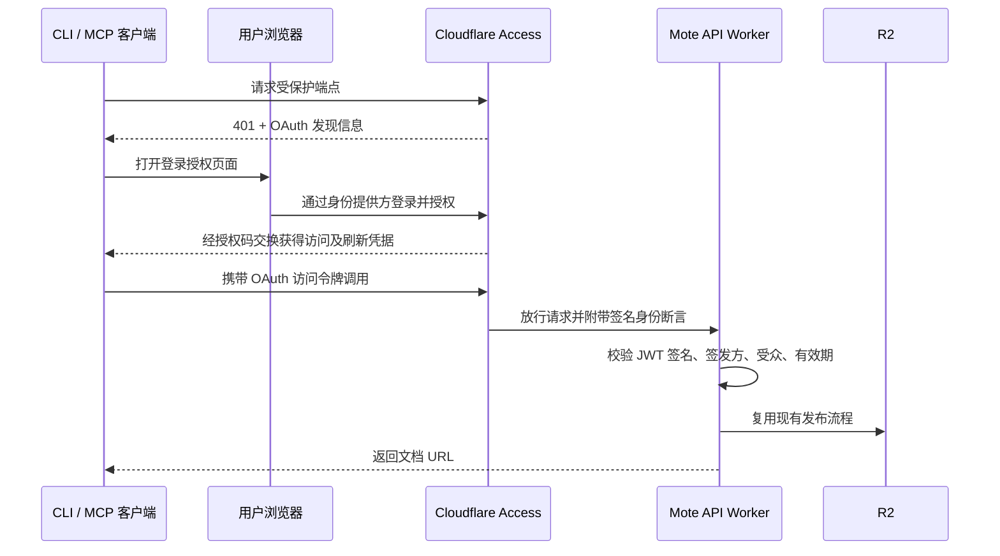

# Mote Cloudflare Access 登录授权实施计划

> **计划编号**：005
> **日期**：2026-09-04
> **状态**：active（Phase 0 进行中；Phase 1–5 待审核）
> **上游计划**：002（远程 MCP）、003（开源与 CLI 发布）
> **架构基线**：`.docs/arcs/Mote：不可变 Markdown 在线发布服务方案.md`

## 1. 目标与已确认范围

用户希望通过 Cloudflare Zero Trust 登录授权发布文档，减少手动配置、分发长期发布密钥；主流 MCP 客户端和 Mote 命令行均纳入范围。

目标体验：

- Mote CLI：运行 `mote auth login`，浏览器登录并授权后显示当前登录账号；之后使用 `mote README.md` 发布，在有效授权会话内自动续期，不反复要求用户登录。
- 远程 MCP：配置 Mote 服务地址，在客户端完成连接授权，之后直接调用发布工具。
- 本地 MCP：复用同一用户的 Mote CLI 登录凭据，继续支持发布本地文件和图片。
- 访问权限：Cloudflare Access 决定谁可以发布；文档阅读继续使用 Capability URL 模型。

本计划只扩展**发布者鉴权**。Mote 的不可变文档、R2 数据结构、Viewer 路由、manifest 提交规则和共享发布链路继续作为约束。登录身份不写入公开文档 manifest，不由本次登录引入文档所有权或用户数据库。

“不手动配密钥”仍需客户端保存访问令牌及刷新凭据。不同 MCP 客户端分别管理自己的授权；不能承诺一次 CLI 登录就自动登录所有远程 MCP 客户端。

## 2. 当前实现与缺口

本次已读取工作区源码；以下是代码现状，不能据此判断 Cloudflare 控制台配置。

| 位置 | 当前行为 | 计划改动 |
|---|---|---|
| `apps/api/src/auth.ts` | 比较共享 `MOTE_TOKEN` | 增加 Access JWT 验证与明确的鉴权模式 |
| `apps/api/src/index.ts`、`mcp.ts` | 发布 API / MCP 分别调用同一 Bearer 校验 | 复用同一身份验证入口，授权先于解析上传内容和写 R2 |
| `apps/cli/src/config.ts`、`run.ts` | 无 token 即报错 | 增加登录命令、鉴权模式及凭据生命周期 |
| `apps/cli/src/client.ts` | 只发送静态 Bearer Token | 支持 OAuth 凭据，处理认证失效，限制重试 |
| `apps/mcp/src/tools.ts` | 强制要求静态 token | 复用 CLI 的认证解析和刷新能力 |
| `apps/api/wrangler.toml` | API 使用 `mote.flc.io/api/*` 路由 | 增加 Access 配置参数，并核对备用入口 |
| `packages/protocol/src/mcpTools.ts` | MCP 协议版本 `2025-06-18` | 对实际客户端验证协商行为，按结果做必要适配 |

计划 002 的交付备注明确记录：Claude 网页版、ChatGPT 实测曾被用户允许跳过。本计划重新纳入验证，不能把旧计划完成状态作为兼容性证据。

架构基线 §15、§21、§38 等固定了旧 Bearer 方案。实施时要同步扩展这些发布鉴权约定，明确阅读端的免登录与发布端的登录是不同权限边界；本次规划不改写已完成计划的历史记录。

## 3. 首选架构

采用 **Cloudflare Access Managed OAuth**。Cloudflare 承担 OAuth 授权服务，Mote API 作为受保护资源。官方文档将其标为 Beta；是否能在当前账号启用，以及是否满足全部目标客户端，留给 Phase 0 实测。



Managed OAuth 给客户端的令牌是 opaque token；Worker 验证的是 `Cf-Access-Jwt-Assertion`，不把客户端 Bearer 字符串当成 JWT 解码。该方案与 Worker 验证要求见 [Managed OAuth](https://developers.cloudflare.com/cloudflare-one/access-controls/applications/http-apps/managed-oauth/) 和 [Validate JWTs](https://developers.cloudflare.com/cloudflare-one/access-controls/applications/http-apps/authorization-cookie/validating-json/)。

### 3.1 Cloudflare 应用与策略

- 首选保留现有发布 API 和 MCP URL。拟由一个 Access 应用覆盖 `/api/v1/publish`、`/api/mcp` 和新增的 `/api/auth/*`；Phase 0 核验同域多路径、OAuth resource 值及发现端点的实际行为。
- `/api/health`、Viewer `/health` 和文档阅读路径维持当前用途。采用精确保护路径，避免为了 OAuth 元数据而给整个 `/api/*` 配置放行规则。
- OAuth 发现地址必须可被客户端读取。特别验证 `/.well-known/*` 是否被 Access 正确处理，以及现有 Viewer 通配路由是否影响发现；仅在证据表明确有需要时补最小路由。
- 若现有同域路径布局确实不兼容，先提出独立 API 域名的迁移设计与旧地址处理方案，再决定实施，不在实现中悄悄换域名。
- 优先复用现有身份提供方；尚未配置时，建议先以指定邮箱白名单 + 邮箱验证码打通，再按需要接入 Google / GitHub 或已有组织 SSO。具体允许账号在配置阶段确定。
- 以身份策略作为所有客户端共用的基础。云端 MCP 调用不能依赖用户本机的 WARP、固定出口 IP 或设备证书；需要更严格设备策略时，另行评估浏览器登录与后台刷新两段的兼容性。
- 原生客户端按需启用 localhost / loopback 回调，云端客户端逐个登记实际 HTTPS 回调 URI；不配置任意公网域名的回调通配。
- 按用户本机自用、长期登录的偏好，已确认的目标参数为访问令牌 7 天、授权会话 30 天。这是当前实例偏便利的部署配置，不在 CLI 中硬编码；同一 Access 应用保护的远程 MCP 也受该策略约束。Phase 0 核验平台是否接受这组时长及其实际生命周期；若不支持，记录限制与可选参数，再由用户确认调整。
- 访问令牌到期由客户端自动刷新，授权会话到期或刷新凭据失效时才提示重新登录；不承诺被撤权后仍可用满 30 天。本机保存不意味着令牌只能在本机使用，长有效期可能扩大令牌泄露后的可用窗口；策略更新、会话撤销与 JWT 失效的传播时间要实测，不能宣称撤销后所有已签发凭据立刻失效。

路径保护依据 [Application paths](https://developers.cloudflare.com/cloudflare-one/access-controls/policies/app-paths/)；回调与令牌设置依据 [Managed OAuth settings](https://developers.cloudflare.com/cloudflare-one/access-controls/applications/http-apps/managed-oauth/#managed-oauth-settings)。

### 3.2 服务端鉴权模式

拟增配置：`MOTE_AUTH_MODE=token|cloudflare-access`，以及 Access team issuer、Application AUD。配置名在实现阶段统一定稿。

- `token`：供现有自托管部署继续使用；未设置模式时保持旧版本行为。
- `cloudflare-access`：生产迁移目标。必须通过 JWT 校验，不因旧 `MOTE_TOKEN` 仍存在就允许绕过；缺配置、签名失败或无法取得所需验证密钥时拒绝请求。
- JWKS 缓存与密钥轮换使用成熟验证库（优先评估 `jose`）；仅从配置的可信 issuer 取密钥，限制算法、受众和时间字段。
- 校验签名后才读取身份。统一返回内部发布者上下文，不信任未验证的邮箱头；当前授权粒度为“可发布”，不虚构细粒度文档权限或 Cloudflare 未签发的 `mote:publish` scope。
- 新增受保护 `GET /api/auth/session`，用于 CLI 登录完成后的身份确认与只读连接检查；只返回必要身份信息，响应不缓存，不返回任何原始令牌。
- 盘点并关闭不需要的 `workers.dev` / Preview URL；验证允许主机，其他路由和入口同样不能绕过鉴权。
- 日志可记录经过验证的稳定发布者标识用于排障，但不记录 token、Cookie、授权码或文档正文。公开 R2 元数据不增加身份字段。

### 3.3 CLI 与本地 MCP

认证命令统一放在 `mote auth` 命令组下（尚未实现）：

```bash
mote auth login --api https://mote.flc.io
mote auth status
mote auth logout
mote README.md
```

- `mote auth login`：发现授权配置，执行 Authorization Code + PKCE S256；使用随机 `state` 和临时 loopback 回调，只监听本机，设置超时并关闭监听器。浏览器无法自动打开时给出登录 URL；成功后通过身份检查端点确认并显示当前账号及 API 目标，不显示凭据。
- 公共客户端不内置 client secret。客户端注册、resource、issuer、scope 从经过校验的发现结果获取；优先评估仓库已使用的 MCP SDK OAuth helper，验证 Node 20、打包体积和 API 适用性后定依赖。
- 身份提供方与资源 URL 的关系必须被校验；凭据按 API 目标、issuer 和 resource 隔离。上传拒绝跨源重定向，发现/注册请求使用独立的 URL 安全策略，防止把内容或令牌发往其他服务。
- 凭据与普通配置分开保存，不把 access/refresh token 写进仓库、命令行参数或日志。优先使用系统凭据库：macOS Keychain、Windows Credential Manager、Linux Secret Service；具体依赖与三平台可用性在实现阶段验证。无可用凭据库时明确告知用户并降级到私有凭据文件：POSIX 目录 0700、文件 0600，Windows 验证等价用户访问权限；文件采用原子写入，不因凭据库临时锁定或访问失败而静默切换存储后端。
- CLI 与本地 MCP 共用凭据存储、自动刷新函数及进程间刷新锁，避免同时刷新造成凭据覆盖。在有效授权会话内自动续期，不要求用户手动执行刷新命令；刷新凭据失效后明确要求重新 `mote auth login`。
- `mote auth status` 显示当前账号、API 地址、认证模式和授权会话状态，区分本地缓存状态与在线确认结果；仅在服务端提供相应信息时显示会话到期时间，未知时明确标注，不用 access token 到期时间替代授权会话到期时间。
- `mote auth logout` 清理本机当前目标凭据，并明确提示这不等于远端授权已撤销或所有设备退出。全局撤销由 Access 管理，若其支持合适的 OAuth 撤销端点，再增加明确区分的远端注销方式。
- 发布前先完成凭据准备；只对明确认证拒绝、且确认没有进入写入流程的请求考虑单次刷新重试。网络超时、5xx、结果不明确的发布不自动重放，防止重复生成文档。
- 首版显式 `mote auth login`；发布失败、`--json`、非交互执行和 MCP tool 调用不自动弹浏览器或等待用户输入。无法自动续期时返回可执行的 `mote auth login` 提示。
- 本地 MCP 启动和调用保持 stdio 协议输出纯净。它复用 CLI 登录态，不读取或复制 Cursor / Codex / Claude 各自的凭据库。
- OAuth 模式下忽略旧环境 token 的隐式覆盖；显式选择静态 token 模式才使用旧配置优先级。迁移文档解释旧 `MOTE_TOKEN` 与新登录态的选择规则。

## 4. 主流客户端验收矩阵

以下全部是**目标，当前均未完成本计划的端到端验证**。记录客户端版本、操作系统、账号能力、注册方式、实际回调 URI、测试日期及结果；“官方说明支持 OAuth”不等于“已验证兼容 Mote”。

| 客户端 / 入口 | 首选方式 | 必须验证的差异 |
|---|---|---|
| Mote CLI | `mote auth login` 浏览器登录 | macOS / Linux / Windows，loopback、系统凭据库与文件降级、自动刷新、无浏览器提示、JSON 模式 |
| Mote 本地 MCP（stdio） | 复用 CLI 凭据 | 本地文件和图片、并发刷新、登录失效提示 |
| Cursor IDE / Agent | 原生远程 MCP OAuth | 桌面与云端分别记录；回调、发现和重连 |
| Claude Code | 原生远程 MCP OAuth | `/mcp` 登录、动态端口、DCR / 客户端元数据注册选择 |
| Claude Desktop | 远程连接器 OAuth；本地文件走 stdio | 远程连接器与本地 MCP 分别验证 |
| Claude.ai | 远程连接器 OAuth | 公网发现、精确 resource URL、云端回调和刷新 |
| ChatGPT | 支持自定义写入工具的远程 MCP 入口 | 实际账号入口、注册方式、回调、工具授权与发布；不以仅检索入口代替 |
| Codex CLI / Desktop / IDE | 原生远程 MCP OAuth | 各入口实际能力、登录、回调端口、DCR / CIMD、缓存恢复 |
| VS Code / GitHub Copilot | 原生远程 MCP OAuth | loopback / vscode.dev 回调、动态注册和重连 |
| Gemini CLI | 原生远程 MCP OAuth | 发现、登录、刷新和断线恢复 |

共同通过标准：配置地址 → 登录 → `initialize` → `tools/list` → 发布 → 返回有效文档 URL → 令牌到期后续用 → 撤权后拒绝 → 重新授权可恢复。

兼容性重点：

1. `401` / `WWW-Authenticate`、RFC 9728 资源元数据、RFC 8414 授权服务器元数据、RFC 8707 resource 必须一致，包含 `/api/mcp` 路径的匹配是重点。
2. 优先使用 Access 实际支持的动态注册方式；不为了通过界面而要求用户粘贴长期发布密钥。OAuth client ID 属于公开标识，与发布密钥区分。
3. ChatGPT 的回调随授权服务器能力及连接器实例变化，部署时复制界面给出的完整地址，不沿用旧示例中的单个固定地址。Claude、Cursor、VS Code 也分别登记官方规定与实际发出的回调。
4. 保留现有无状态 MCP 和远程 `publish_markdown` 工具语义。对协议版本协商、GET 405、通知 202、工具描述及所需授权元数据做真实客户端验证，按失败证据决定最小修正。
5. 某客户端需要桥接时，记录为“桥接支持”，不能记作原生支持；云端客户端不能用本地 stdio 桥接代替验收。
6. 账号套餐、组织设置或未安装客户端造成无法验证时，明确列为“未验证及原因”；未完成目标不能宣布“主流全部支持”。

参考：[Claude connector authentication](https://claude.com/docs/connectors/building/authentication)、[OpenAI authentication](https://developers.openai.com/plugins/build/auth)、[Codex MCP](https://learn.chatgpt.com/docs/extend/mcp?surface=cli)、[VS Code MCP](https://code.visualstudio.com/api/extension-guides/ai/mcp)、[Cursor MCP](https://cursor.com/docs/context/mcp)、[Claude Code MCP](https://code.claude.com/docs/en/mcp)、[Gemini CLI MCP](https://geminicli.com/docs/tools/mcp-server/)。本机 `codex mcp login --help` 已确认存在 OAuth 登录及注册方式选择；未执行登录。

## 5. 实施阶段

沿用 Handoff 的阶段审核流程：待审核 → 已审核 → 进行中 → 用户验收后已完成。本计划使用工作分支 `feat/cloudflare-access-oauth`；创建分支不代表任何实施阶段已获执行授权。

执行约定（用户于 2026-09-04 明确）：

1. **逐阶段执行**：只有用户明确要求执行某个阶段后，才开始该阶段；阶段交付后等待用户验收与下一阶段指令，不自行连续推进。整体同意计划不等于一次性授权所有阶段。
2. **提交与推送单独授权**：实施时保持变更在工作区；提交和推送分别以用户明确指令为准。阶段执行授权不包含提交或推送授权。
3. **Cloudflare 尚未配置自动化部署**：不假定提交、推送或现有 Release 流程会部署 Worker。部署和 Access 配置变更在获授权阶段内按确认的目标环境与清单单独执行；搭建自动化部署流水线不属于本次默认范围。

用户于 2026-09-04 明确要求开始 Phase 0；Phase 1–5 尚未获执行授权。只有实际完成并有验证记录的事项才可勾选；Checklist 完成不等于阶段已验收。遇到未验证项或范围调整时，记录原因并交由用户决定，不自行降低交付标准。

### 阶段状态总览

| 阶段 | 状态 |
|---|---|
| Phase 0 — 兼容性与架构验证 | 进行中 |
| Phase 1 — 服务端鉴权 | 待审核 |
| Phase 2 — CLI 登录与凭据管理 | 待审核 |
| Phase 3 — 本地与远程 MCP 适配 | 待审核 |
| Phase 4 — 文档与发布准备 | 待审核 |
| Phase 5 — 生产迁移与回退演练 | 待审核 |

### 5.1 Phase 0 — 兼容性与架构验证

**状态**：进行中（2026-09-04 获执行授权；测试 Access 应用已创建，7 天 / 30 天已通过 API 写入和读回，端到端验证待执行）

**目标**：在隔离环境中验证 Managed OAuth 能否满足 Mote CLI 与全部目标 MCP 客户端，形成后续实现所需的配置和兼容性依据。

**前置条件**：用户明确要求执行 Phase 0；确认可操作的 Cloudflare 账号、测试域名、资源命名与客户端账号。输入项见 §8，回调清单等验证产物在本阶段生成。

**执行记录**：[Phase 0 验证记录](../reports/005-2026-09-04-phase-0-access-oauth.md)。已完成本地盘点、依赖安装、官方资料核验、生产只读基线及控制台检查。经用户确认，已保存单邮箱策略，并通过 API 创建 `mote-oauth-test` 应用（HTTP 201）；独立 GET 读回确认 `access_token_lifetime: 168h`、`session_duration: 720h`、三个保护路径、仅 One-time PIN 及本机回调配置。控制台最高 24 小时的菜单不代表 API 上限。测试 DNS、Worker 和 R2 尚未创建，真实 OAuth 登录、签发、刷新和撤权仍未验证，以下端到端事项保持未勾选。

**本轮确认**：测试域名使用 `mote-oauth-test.flc.io`，资源前缀 `mote-oauth-test`；准入邮箱已由用户提供，不在公开文档中写入明文。用户已同意保留并复用实测发现的 `flc1125.cloudflareaccess.com` 团队，不再按最初“未配置”的假设新建 `mote-test`，也不修改既有团队、IdP、其他应用或隧道。测试应用及单邮箱策略的保存、仅限当前账号且一天有效的 Access 应用/策略编辑 API 凭据均已获动作确认。原定 7 天 / 30 天已原值写入，未缩短；API 接受不等于实际签发或长时间观测通过。先以 Codex 为实测对象，其余客户端暂缓，不视为已通过；全部目标的最终交付标准不因此自动变更。

#### Checklist

- [ ] 核对 Zero Trust team domain、可用 IdP、允许发布的用户/邮箱，以及 Managed OAuth Beta 的账号可用性、权限与费用条件。
- [ ] 按确认的范围建立独立测试域名、Worker、R2 和 Access 测试应用，记录资源名称及后续清理范围；不修改或清理生产 R2 数据。
- [ ] 在隔离环境验证 `/api/v1/publish`、`/api/mcp`、`/api/auth/*` 的保护布局，以及健康检查和 Viewer 阅读路径的边界。
- [ ] 核验 `401` / `WWW-Authenticate`、资源及授权服务器元数据、resource 值和 `/.well-known/*` 路由，记录实际返回结果。
- [ ] 验证 Access 向 Worker 传递 `Cf-Access-Jwt-Assertion` 的行为，取得后续 JWT 验证所需的 issuer、AUD 和 JWKS 地址。
- [ ] 核验客户端注册方式、loopback 与云端回调 URI，形成精确回调清单；不配置任意公网回调通配。
- [ ] 验证访问令牌 7 天、授权会话 30 天的配置是否被平台接受，记录实际签发的生命周期、刷新与撤权行为；不支持时列出限制并等待用户确认调整。
- [ ] 按 §4 对全部目标完成最小 OAuth 与 MCP 调用验证；Mote CLI/stdio 尚未实现的部分使用隔离验证原型，不替代 Phase 2、Phase 3 的正式交付。
- [ ] 记录各客户端版本、操作系统、账号能力、注册方式、回调 URI、测试日期、原生/桥接方式和结果；不可验证项注明原因。
- [ ] 汇总同域路径方案的可行性、未解决差异及后续配置输入，提交用户审核。

#### 交付标准

1. 全部目标完成最小 OAuth 与 MCP 调用验证，形成可复核的客户端记录；不能将桥接或“未验证”记为原生通过。
2. 已确定可行的域名/路径布局、发现与注册方式、回调清单、Access 身份断言及令牌配置，路径/resource、刷新和账号限制均有证据。
3. 7 天 / 30 天目标有平台验证结果；若需要调整，已取得用户确认，未把拟议参数当成实际支持能力。
4. 测试环境与生产资源隔离，测试文档无敏感内容，资源记录与清理范围明确，生产数据未被改动。
5. 结论足以决定是否进入服务端实现；必要目标仍未验证或存在无法解决的差异时，不宣布本阶段通过。

**不兼容时的处理**：先排查回调、resource、scope 或版本配置问题。确认平台能力缺口后，提出 **Access 作为上游 IdP + Worker OAuth 适配层** 的备选设计，列清额外依赖、存储和迁移成本，等待用户确认后调整计划；不通过放宽认证、长期 token 回退或放弃云端客户端来宣称达标。

### 5.2 Phase 1 — 服务端鉴权

**状态**：待审核

**目标**：在不改变发布协议和存储模型的前提下，让 API 与远程 MCP 共用明确、不可绕过的身份验证入口。

**前置条件**：Phase 0 已获用户验收，架构与配置输入已明确；用户明确要求执行 Phase 1。生产切换仍留到 Phase 5。

#### Checklist

- [ ] 确定鉴权配置名和类型，实现 `token` / `cloudflare-access` 两种部署模式；未配置模式时保留旧版本行为。
- [ ] 采用成熟验证库处理 Access JWT 签名、issuer、aud、有效期和未来生效时间，不把客户端 opaque token 当作 JWT。
- [ ] 实现可信 issuer 限制、JWKS 缓存与密钥轮换；缺配置、无所需验证密钥或验证失败时拒绝请求。
- [ ] 将发布 API 与远程 MCP 接入统一鉴权入口，身份验证先于上传内容解析和 R2 写入；Access 模式不接受旧 `MOTE_TOKEN` 旁路。
- [ ] 返回仅供内部使用的发布者上下文，不信任未验证的邮箱头，不向公开 manifest 增加身份或所有权字段。
- [ ] 实现受保护的 `GET /api/auth/session`，只返回必要身份信息，禁用缓存，不输出原始令牌。
- [ ] 补齐允许主机与备用入口的防绕过措施，在隔离环境核验 `workers.dev` / Preview URL，形成生产入口处理清单。
- [ ] 更新 Worker 配置、生成类型及架构基线中的鉴权说明，保持 Viewer、健康检查和 manifest 最后提交规则不变。
- [ ] 增加并执行 JWT、伪造头、JWKS 轮换/故障、模式隔离、入口覆盖、身份端点及发布回归测试，检查日志不泄露凭据和正文。

#### 交付标准

1. 有效 Access 身份可调用发布 API 与远程 MCP；静态 token 模式保持原有行为，两种模式边界清楚。
2. 伪造、过期、错误 issuer/aud、缺配置及所需密钥不可用的请求均被拒绝；Access 模式下旧 token 不能绕过，鉴权拒绝请求零 R2 写入。
3. 身份端点返回必要的已验证身份信息且不缓存；其他主机入口不能绕过认证，日志与公开 manifest 不泄露秘密或新增用户身份。
4. 相关测试通过，原有 Markdown/图片发布、manifest 原子提交、Viewer 阅读和健康检查行为保持不变。
5. 配置、类型、代码和架构基线一致；生产鉴权尚未切换。

### 5.3 Phase 2 — CLI 登录与凭据管理

**状态**：待审核

**目标**：提供统一的 `mote auth` 命令组与共享凭据能力，使本机登录、发布、自动续期和退出具有清晰可靠的行为。

**前置条件**：Phase 1 已获用户验收，隔离环境鉴权与身份端点可用；用户明确要求执行 Phase 2。

#### Checklist

- [ ] 实现 `mote auth login`、`mote auth status`、`mote auth logout` 的命令解析、帮助和错误提示，不使用旧顶层登录/退出命令。
- [ ] 实现发现与客户端注册、Authorization Code + PKCE S256、随机 state、本机临时回调和超时清理；浏览器打不开时提供登录 URL。
- [ ] 校验发现结果中的 issuer/resource 关系和 URL 安全性；登录完成后在线确认身份并显示账号及 API 目标。
- [ ] 评估 OAuth helper 与凭据库依赖的 Node 20 兼容性、打包体积及三平台适用性，不内置 client secret。
- [ ] 接入 macOS Keychain、Windows Credential Manager、Linux Secret Service；无可用凭据库时显式降级到私有文件，落实权限和原子写入，临时锁定或访问失败不静默切换后端。
- [ ] 按 API 目标、issuer 和 resource 隔离凭据，CLI/stdio 共用存储接口、自动刷新函数与进程间刷新锁。
- [ ] 实现 `mote auth status` 的账号、API、认证模式与会话状态展示，区分缓存和在线结果，未知会话到期时间明确标注。
- [ ] 实现 `mote auth logout` 的当前目标凭据清理，明确本地退出与远端撤销的差别；远端注销仅按 §3.3 的已验证能力处理。
- [ ] 将发布客户端接入凭据准备与自动刷新，拒绝上传跨源重定向；仅对确定尚未写入的认证拒绝考虑单次刷新重试，不重放超时、5xx 或未知结果。
- [ ] 保留显式静态 token 模式及旧配置优先级；OAuth 模式不被旧环境 token 隐式覆盖。
- [ ] 保证发布失败、`--json`、非交互执行及 MCP tool 调用不自动弹浏览器或等待输入；无法续期时提示 `mote auth login`。
- [ ] 在 macOS / Linux / Windows 验证登录、存储与降级、权限、跨目标隔离、并发刷新、取消/端口占用/超时、异常退出恢复及状态/退出语义，执行相关测试和 CLI 构建检查。

#### 交付标准

1. 三个认证命令可用，成功登录后可发布；访问令牌到期能自动续期，刷新凭据失效有可执行的重新登录提示。
2. 三平台目标用例通过，系统凭据库与文件降级路径可验证，凭据不串账号或目标，存储和日志不泄露秘密。
3. CLI/stdio 并发刷新及进程中断不会覆盖有效凭据；网络超时或未知发布结果不会自动重复生成文档。
4. 状态输出不把缓存当在线确认、不混淆两种到期时间；退出仅清理当前目标，不虚称已全局撤权。
5. 非交互与机器输出保持可用，旧静态 token 模式兼容，相关测试与 CLI 构建检查通过。

### 5.4 Phase 3 — 本地与远程 MCP 适配

**状态**：待审核

**目标**：让本地 MCP 复用 CLI 登录态，并在全部目标客户端中验证远程 OAuth 与真实发布链路。

**前置条件**：Phase 2 已获用户验收，共享凭据能力可用；用户明确要求执行 Phase 3。

#### Checklist

- [ ] 将本地 stdio MCP 接入 CLI 共享鉴权、存储与刷新能力，不读取或复制其他客户端的凭据库。
- [ ] 验证本地 `publish_markdown`、`publish_markdown_file` 的真实发布链路，覆盖 Markdown、本地图片、内容去重和返回 URL。
- [ ] 验证 stdio 启动与工具调用的输出纯净性、并发刷新、登录失效提示，以及不自动弹浏览器的行为。
- [ ] 保留远程无状态 MCP 与 `publish_markdown` 语义，仅按 Phase 0 和真实客户端失败证据修正协议协商、GET 405、通知 202、工具描述及授权元数据。
- [ ] 在隔离环境按已确认布局配置远程发现、注册与回调，复核公网可达性及 resource 一致性。
- [ ] 按 §4 对全部目标客户端重新验证登录、`initialize`、`tools/list`、真实发布、有效 URL、到期续用、撤权拒绝和重新授权恢复。
- [ ] 更新客户端版本、账号能力、回调与测试记录，区分原生、桥接、失败和未验证；不以本地桥接替代云端客户端验收。
- [ ] 执行 MCP 单元与集成测试，确认本地/远程入口仍复用既有发布管线和协议。

#### 交付标准

1. 本地 MCP 可复用 CLI 登录态发布本地文件和图片，刷新与失效行为正确，stdio 无非协议输出污染。
2. 全部目标客户端通过 §4 的真实发布与授权生命周期验收，有完整记录；不可验证项不能计作通过或宣称“主流全部支持”。
3. 本地和远程 MCP 均复用既有发布实现，远程无状态语义、工具能力与返回结果未被擅自扩展或削弱。
4. 相关单元与集成测试通过，跨客户端凭据独立管理，不存在未经验证的登录态共享。

### 5.5 Phase 4 — 文档与发布准备

**状态**：待审核

**目标**：让用户能够按文档配置、登录和发布，完成迁移准备与仓库质量门禁；本阶段不切换生产。

**前置条件**：Phase 3 已获用户验收，正式实现与客户端结果已明确；用户明确要求执行 Phase 4。

#### Checklist

- [ ] 更新 README、CLI/MCP 指南、Skill 相关说明及对应语言副本，统一 `mote auth login` / `status` / `logout` 的示例和错误处理说明。
- [ ] 更新安全与自托管指南，解释两种鉴权模式、身份边界、系统凭据库/文件降级、会话时长和本地退出/远端撤销的区别。
- [ ] 编写从 `MOTE_TOKEN` 到 OAuth 的迁移说明，明确旧环境变量、登录态及显式静态 token 模式的选择规则；机器身份仍为范围外事项。
- [ ] 同步架构基线、Handoff 和 CHANGELOG，标明实际验证的客户端、限制及未验证项，不改写已完成计划的历史记录。
- [ ] 整理 Phase 5 的生产迁移与回退清单：目标环境、当前版本、路由、发布者、回调、切换窗口、验收窗口和旧凭据使用者，不包含秘密值。
- [ ] 检查文档链接、配置示例和日志样例，不包含真实凭据；明确当前无 Cloudflare 自动化部署，npm/GitHub Release 与 Worker 部署分别处理。
- [ ] 执行 `pnpm lint`、`pnpm typecheck`、`pnpm test`、`pnpm build`、`pnpm --filter @mote/cli test:package`、`pnpm format:check`，记录结果。
- [ ] 在隔离环境按文档复核配置、登录、发布和退出流程，提交发布准备材料供用户验收；不擅自提交、推送、发布版本或部署生产。

#### 交付标准

1. 用户可按文档完成配置、登录与发布，命令、鉴权模式和凭据选择规则与实现一致，文档间互链有效。
2. 安全边界、已验证客户端、生命周期限制及未验证项表述准确，代码、配置、文档与日志均不包含真实秘密。
3. 仓库 lint、typecheck、test、build、CLI 打包检查及格式检查全部通过，有验证记录。
4. 生产迁移、发布/部署与回退清单已准备，明确分别需要的授权；生产鉴权未切换，Cloudflare 部署流水线未被擅自新增。

### 5.6 Phase 5 — 生产迁移与回退演练

**状态**：待审核

**目标**：按已确认清单将生产发布鉴权切换到 Access，完成客户端迁移、撤权验证与可执行的回退演练。

**前置条件**：Phase 4 已获用户验收；用户明确要求执行 Phase 5，并确认目标环境、发布/部署清单和切换/验收窗口。提交和推送仍分别等待明确指令。

#### Checklist

- [ ] 记录当前 Worker 版本、路由、Access 应用配置与旧凭据使用者，准备有效回退鉴权配置；记录不含秘密值。
- [ ] 按确认的清单发布支持两种模式的新服务端，生产暂保持 `token` 模式；分别发布并验证新版 CLI，确认旧调用仍可用。
- [ ] 配置生产 IdP、允许发布者、精确回调 URI 与 Access 策略，完成备用主机入口处理；不扩大放行范围。
- [ ] 按 §7 的顺序，在确认的切换窗口先启用 Access 保护，再将 Worker 切为 `cloudflare-access`；记录版本、配置与短暂不可发布窗口。
- [ ] 逐客户端迁移并移除该生产服务的静态 Bearer 配置，完成真实登录和发布冒烟，检查返回 URL 可访问。
- [ ] 验证未授权请求、旧 token、伪造身份头与备用入口不能绕过；核验健康检查及已发布文档/图片保持正常。
- [ ] 验证访问令牌刷新、发布者撤权后的实际拒绝时效及重新授权恢复，记录观测结果。
- [ ] 按 §7 回退顺序执行确认范围内的演练，验证恢复旧鉴权后再撤回 Access 保护的顺序，记录客户端配置切回方式和恢复结果。
- [ ] 演练后恢复并验证已确认的目标部署状态；经过约定验收窗口后，按清单清理不再需要的 `MOTE_TOKEN` 与客户端旧配置。
- [ ] 汇总部署、客户端迁移、生产冒烟、撤权、回退与清理记录，提交用户最终验收。

#### 交付标准

1. 生产处于已确认的新鉴权状态，目标客户端可以登录与发布；部署版本、路由、Access 配置与迁移结果有记录。
2. 未授权、旧 token 和其他入口绕过验证失败，健康检查及历史文档/图片访问正常；切换和回退全过程不存在开放写入窗口。
3. 刷新、撤权拒绝时效和重新授权恢复有实测记录，不把目标时长或预期传播时间当作实测结果。
4. 回退顺序、有效鉴权配置和客户端切回步骤经过演练，演练后恢复至目标状态；旧凭据仅在约定窗口结束后按清单清理。
5. 所有执行记录交付用户验收，提交、推送和部署均未超出明确授权范围；只有用户验收后才将计划标记为完成。

## 6. 必要验证

- 服务端：JWT 签名、issuer、aud、过期、未来生效时间、缺失配置、伪造头、JWKS 轮换/故障及主机入口覆盖；静态 token 与 Access 两种模式的边界。
- 登录客户端：state / PKCE、issuer/resource 不一致、恶意发现地址、非本机回调、用户取消、端口占用、超时、缓存损坏、权限错误和跨账号/跨站点隔离。
- 凭据存储：三平台系统凭据库读写、库不可用时的显式文件降级、临时锁定或访问失败处理、文件权限与原子写入；CLI/stdio 使用一致的存储后端。
- 凭据刷新：7 天目标访问令牌与 30 天目标授权会话配置、访问令牌到期后自动续期、刷新凭据失效、CLI/stdio 并发、进程中断后恢复；移除用户权限后验证实际拒绝时效。
- 认证命令：示例、帮助与错误提示统一使用 `mote auth login` / `mote auth status` / `mote auth logout`；状态输出区分缓存与在线结果；退出只清理当前目标，未执行远端撤销时不声称授权已撤销。
- 发布：401 发生在写入之前；超时和未知结果不会触发自动重复发布；Markdown、本地图片、manifest 最后提交及返回 URL 行为回归。
- 协议：认证挑战和发现端点可达；同域 Viewer 路由不会吞掉 OAuth 元数据；服务身份端点不缓存；已有健康检查正常。
- 验证门禁：实施阶段运行相关测试；集成完成后执行仓库现有 lint、typecheck、test、build、CLI test:package、format:check。规划文档本身只检查格式和差异。

## 7. 生产迁移顺序

生产动作在实现、隔离环境验证及具体迁移清单准备完成，且用户明确要求执行 Phase 5 后进行。当前 Cloudflare 无自动化部署，Worker 部署与 npm/GitHub Release 分别处理；不得以已提交、已推送或 CLI 已发布作为 Worker 已部署的证据。

1. 记录当前 Worker 版本、路由、Access 应用配置及旧凭据使用者，准备回退配置；避免日志和变更记录包含秘密值。
2. 发布支持两种部署模式的新服务端版本，生产暂保持 `token` 模式；发布并验证新版 CLI，让现有调用可继续工作。
3. 提前配置 IdP、允许发布者、实际回调 URI 和 Access 策略；保护范围按最终验证的路径布局设置。
4. 在约定切换窗口先启用 Access 保护，再把 API Worker 切为 `cloudflare-access`，验证新登录和发布。两步间可能短暂不能发布，需明确提示；不要先删除旧鉴权产生开放写入窗口。
5. 逐客户端迁移，移除指向该生产服务的静态 Bearer 配置；完成未授权请求、旧 token、其他主机入口与已发布页面检查。
6. 经过约定验收窗口后清理不再需要的 `MOTE_TOKEN` 和客户端旧配置。清理前旧密钥即使保留也不在 Access 模式生效。

回退：先恢复带有有效旧鉴权配置的 `token` 模式或已验证的 Worker 版本，再撤回新增 Access 保护；顺序确保发布接口始终有鉴权。若旧密钥已经清理，先准备新的回退凭据。回退需要通知客户端切回对应配置，不把登录态自动转换成静态密钥。

## 8. 开始实施前需要落实的信息

- Cloudflare Zero Trust team domain、可用登录源、允许发布的用户/邮箱，以及 Managed OAuth 的账号可用性。
- 隔离测试域名和资源命名；实际客户端版本、可用账号和云端自定义工具权限。
- Phase 0 生成的回调 URI 清单、最终路径/域名布局、令牌生命周期与撤权时效记录。
- 若目标还包含完全无人参与的 CI 定时发布，另行确定机器身份；本计划的用户登录授权不能保证无人值守任务永不重新登录。Workers 自动部署凭据不属于本次发布鉴权变更。

上面是实施输入项，不阻塞本计划草稿评审。主流客户端与命令行均为已确认范围；具体账号能力在验证阶段核实。
