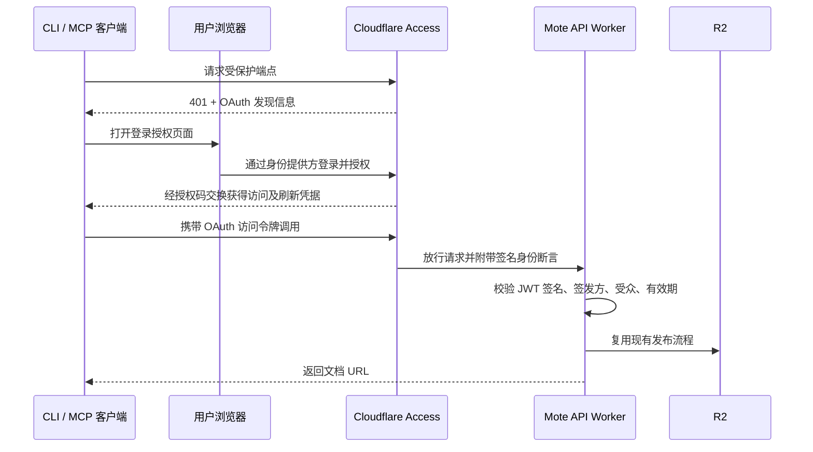

# Mote Cloudflare Access 登录授权实施计划

> **计划编号**：005
> **日期**：2026-09-04
> **状态**：draft（仅规划，所有实施阶段待审核）
> **上游计划**：002（远程 MCP）、003（开源与 CLI 发布）
> **架构基线**：`.docs/arcs/Mote：不可变 Markdown 在线发布服务方案.md`

## 1. 目标与已确认范围

用户希望通过 Cloudflare Zero Trust 登录授权发布文档，减少手动配置、分发长期发布密钥；主流 MCP 客户端和 Mote 命令行均纳入范围。

目标体验：

- Mote CLI：运行 `mote login`，浏览器登录并授权后，继续使用 `mote README.md` 发布。
- 远程 MCP：配置 Mote 服务地址，在客户端完成连接授权，之后直接调用发布工具。
- 本地 MCP：复用同一用户的 Mote CLI 登录凭据，继续支持发布本地文件和图片。
- 访问权限：Cloudflare Access 决定谁可以发布；文档阅读继续使用 Capability URL 模型。

本计划只扩展**发布者鉴权**。Mote 的不可变文档、R2 数据结构、Viewer 路由、manifest 提交规则和共享发布链路继续作为约束。登录身份不写入公开文档 manifest，不由本次登录引入文档所有权或用户数据库。

“不手动配密钥”仍需客户端保存访问令牌及刷新凭据。不同 MCP 客户端分别管理自己的授权；不能承诺一次 CLI 登录就自动登录所有远程 MCP 客户端。

## 2. 当前实现与缺口

本次已读取工作区源码；以下是代码现状，不能据此判断 Cloudflare 控制台配置。

| 位置 | 当前行为 | 计划改动 |
|---|---|---|
| `apps/api/src/auth.ts` | 比较共享 `MOTE_TOKEN` | 增加 Access JWT 验证与明确的鉴权模式 |
| `apps/api/src/index.ts`、`mcp.ts` | 发布 API / MCP 分别调用同一 Bearer 校验 | 复用同一身份验证入口，授权先于解析上传内容和写 R2 |
| `apps/cli/src/config.ts`、`run.ts` | 无 token 即报错 | 增加登录命令、鉴权模式及凭据生命周期 |
| `apps/cli/src/client.ts` | 只发送静态 Bearer Token | 支持 OAuth 凭据，处理认证失效，限制重试 |
| `apps/mcp/src/tools.ts` | 强制要求静态 token | 复用 CLI 的认证解析和刷新能力 |
| `apps/api/wrangler.toml` | API 使用 `mote.flc.io/api/*` 路由 | 增加 Access 配置参数，并核对备用入口 |
| `packages/protocol/src/mcpTools.ts` | MCP 协议版本 `2025-06-18` | 对实际客户端验证协商行为，按结果做必要适配 |

计划 002 的交付备注明确记录：Claude 网页版、ChatGPT 实测曾被用户允许跳过。本计划重新纳入验证，不能把旧计划完成状态作为兼容性证据。

架构基线 §15、§21、§38 等固定了旧 Bearer 方案。实施时要同步扩展这些发布鉴权约定，明确阅读端的免登录与发布端的登录是不同权限边界；本次规划不改写已完成计划的历史记录。

## 3. 首选架构

采用 **Cloudflare Access Managed OAuth**。Cloudflare 承担 OAuth 授权服务，Mote API 作为受保护资源。官方文档将其标为 Beta；是否能在当前账号启用，以及是否满足全部目标客户端，留给 Phase 0 实测。



Managed OAuth 给客户端的令牌是 opaque token；Worker 验证的是 `Cf-Access-Jwt-Assertion`，不把客户端 Bearer 字符串当成 JWT 解码。该方案与 Worker 验证要求见 [Managed OAuth](https://developers.cloudflare.com/cloudflare-one/access-controls/applications/http-apps/managed-oauth/) 和 [Validate JWTs](https://developers.cloudflare.com/cloudflare-one/access-controls/applications/http-apps/authorization-cookie/validating-json/)。

### 3.1 Cloudflare 应用与策略

- 首选保留现有发布 API 和 MCP URL。拟由一个 Access 应用覆盖 `/api/v1/publish`、`/api/mcp` 和新增的 `/api/auth/*`；Phase 0 核验同域多路径、OAuth resource 值及发现端点的实际行为。
- `/api/health`、Viewer `/health` 和文档阅读路径维持当前用途。采用精确保护路径，避免为了 OAuth 元数据而给整个 `/api/*` 配置放行规则。
- OAuth 发现地址必须可被客户端读取。特别验证 `/.well-known/*` 是否被 Access 正确处理，以及现有 Viewer 通配路由是否影响发现；仅在证据表明确有需要时补最小路由。
- 若现有同域路径布局确实不兼容，先提出独立 API 域名的迁移设计与旧地址处理方案，再决定实施，不在实现中悄悄换域名。
- 优先复用现有身份提供方；尚未配置时，建议先以指定邮箱白名单 + 邮箱验证码打通，再按需要接入 Google / GitHub 或已有组织 SSO。具体允许账号在配置阶段确定。
- 以身份策略作为所有客户端共用的基础。云端 MCP 调用不能依赖用户本机的 WARP、固定出口 IP 或设备证书；需要更严格设备策略时，另行评估浏览器登录与后台刷新两段的兼容性。
- 原生客户端按需启用 localhost / loopback 回调，云端客户端逐个登记实际 HTTPS 回调 URI；不配置任意公网域名的回调通配。
- 建议初始访问令牌 15 分钟、授权会话 7 天，这是拟议参数，最终在 Phase 0 确认。策略更新、会话撤销与 JWT 失效的传播时间要实测，不能宣称撤销后所有已签发凭据立刻失效。

路径保护依据 [Application paths](https://developers.cloudflare.com/cloudflare-one/access-controls/policies/app-paths/)；回调与令牌设置依据 [Managed OAuth settings](https://developers.cloudflare.com/cloudflare-one/access-controls/applications/http-apps/managed-oauth/#managed-oauth-settings)。

### 3.2 服务端鉴权模式

拟增配置：`MOTE_AUTH_MODE=token|cloudflare-access`，以及 Access team issuer、Application AUD。配置名在实现阶段统一定稿。

- `token`：供现有自托管部署继续使用；未设置模式时保持旧版本行为。
- `cloudflare-access`：生产迁移目标。必须通过 JWT 校验，不因旧 `MOTE_TOKEN` 仍存在就允许绕过；缺配置、签名失败或无法取得所需验证密钥时拒绝请求。
- JWKS 缓存与密钥轮换使用成熟验证库（优先评估 `jose`）；仅从配置的可信 issuer 取密钥，限制算法、受众和时间字段。
- 校验签名后才读取身份。统一返回内部发布者上下文，不信任未验证的邮箱头；当前授权粒度为“可发布”，不虚构细粒度文档权限或 Cloudflare 未签发的 `mote:publish` scope。
- 新增受保护 `GET /api/auth/session`，用于 CLI 登录完成后的身份确认与只读连接检查；只返回必要身份信息，响应不缓存，不返回任何原始令牌。
- 盘点并关闭不需要的 `workers.dev` / Preview URL；验证允许主机，其他路由和入口同样不能绕过鉴权。
- 日志可记录经过验证的稳定发布者标识用于排障，但不记录 token、Cookie、授权码或文档正文。公开 R2 元数据不增加身份字段。

### 3.3 CLI 与本地 MCP

拟新增命令（尚未实现）：

```bash
mote login --api https://mote.flc.io
mote auth status
mote logout
mote README.md
```

- `login`：发现授权配置，执行 Authorization Code + PKCE S256；使用随机 `state` 和临时 loopback 回调，只监听本机，设置超时并关闭监听器。浏览器无法自动打开时给出登录 URL。
- 公共客户端不内置 client secret。客户端注册、resource、issuer、scope 从经过校验的发现结果获取；优先评估仓库已使用的 MCP SDK OAuth helper，验证 Node 20、打包体积和 API 适用性后定依赖。
- 身份提供方与资源 URL 的关系必须被校验；凭据按 API 目标、issuer 和 resource 隔离。上传拒绝跨源重定向，发现/注册请求使用独立的 URL 安全策略，防止把内容或令牌发往其他服务。
- 凭据与普通配置分开保存，不把 access/refresh token 写进仓库、命令行参数或日志。首版使用用户私有目录：POSIX 目录 0700、文件 0600，Windows 验证等价用户访问权限；采用原子写入。
- CLI 与本地 MCP 共用凭据存储、刷新函数及进程间刷新锁，避免同时刷新造成凭据覆盖。刷新凭据失效后明确要求重新 `mote login`。
- `auth status` 区分本地缓存状态与在线确认结果；`logout` 清理本机当前目标凭据。全局撤销由 Access 管理，若其支持合适的 OAuth 撤销端点，再增加远端注销；不把本地删文件描述为所有设备退出。
- 发布前先完成凭据准备；只对明确认证拒绝、且确认没有进入写入流程的请求考虑单次刷新重试。网络超时、5xx、结果不明确的发布不自动重放，防止重复生成文档。
- 首版显式 `mote login`；发布失败、`--json`、非交互执行和 MCP tool 调用不自动弹浏览器或等待用户输入。过期时返回可执行的重新登录提示。
- 本地 MCP 启动和调用保持 stdio 协议输出纯净。它复用 CLI 登录态，不读取或复制 Cursor / Codex / Claude 各自的凭据库。
- OAuth 模式下忽略旧环境 token 的隐式覆盖；显式选择静态 token 模式才使用旧配置优先级。迁移文档解释旧 `MOTE_TOKEN` 与新登录态的选择规则。

## 4. 主流客户端验收矩阵

以下全部是**目标，当前均未完成本计划的端到端验证**。记录客户端版本、操作系统、账号能力、注册方式、实际回调 URI、测试日期及结果；“官方说明支持 OAuth”不等于“已验证兼容 Mote”。

| 客户端 / 入口 | 首选方式 | 必须验证的差异 |
|---|---|---|
| Mote CLI | 内置浏览器登录 | macOS / Linux / Windows，loopback、刷新、无浏览器提示、JSON 模式 |
| Mote 本地 MCP（stdio） | 复用 CLI 凭据 | 本地文件和图片、并发刷新、登录失效提示 |
| Cursor IDE / Agent | 原生远程 MCP OAuth | 桌面与云端分别记录；回调、发现和重连 |
| Claude Code | 原生远程 MCP OAuth | `/mcp` 登录、动态端口、DCR / 客户端元数据注册选择 |
| Claude Desktop | 远程连接器 OAuth；本地文件走 stdio | 远程连接器与本地 MCP 分别验证 |
| Claude.ai | 远程连接器 OAuth | 公网发现、精确 resource URL、云端回调和刷新 |
| ChatGPT | 支持自定义写入工具的远程 MCP 入口 | 实际账号入口、注册方式、回调、工具授权与发布；不以仅检索入口代替 |
| Codex CLI / Desktop / IDE | 原生远程 MCP OAuth | 各入口实际能力、登录、回调端口、DCR / CIMD、缓存恢复 |
| VS Code / GitHub Copilot | 原生远程 MCP OAuth | loopback / vscode.dev 回调、动态注册和重连 |
| Gemini CLI | 原生远程 MCP OAuth | 发现、登录、刷新和断线恢复 |

共同通过标准：配置地址 → 登录 → `initialize` → `tools/list` → 发布 → 返回有效文档 URL → 令牌到期后续用 → 撤权后拒绝 → 重新授权可恢复。

兼容性重点：

1. `401` / `WWW-Authenticate`、RFC 9728 资源元数据、RFC 8414 授权服务器元数据、RFC 8707 resource 必须一致，包含 `/api/mcp` 路径的匹配是重点。
2. 优先使用 Access 实际支持的动态注册方式；不为了通过界面而要求用户粘贴长期发布密钥。OAuth client ID 属于公开标识，与发布密钥区分。
3. ChatGPT 的回调随授权服务器能力及连接器实例变化，部署时复制界面给出的完整地址，不沿用旧示例中的单个固定地址。Claude、Cursor、VS Code 也分别登记官方规定与实际发出的回调。
4. 保留现有无状态 MCP 和远程 `publish_markdown` 工具语义。对协议版本协商、GET 405、通知 202、工具描述及所需授权元数据做真实客户端验证，按失败证据决定最小修正。
5. 某客户端需要桥接时，记录为“桥接支持”，不能记作原生支持；云端客户端不能用本地 stdio 桥接代替验收。
6. 账号套餐、组织设置或未安装客户端造成无法验证时，明确列为“未验证及原因”；未完成目标不能宣布“主流全部支持”。

参考：[Claude connector authentication](https://claude.com/docs/connectors/building/authentication)、[OpenAI authentication](https://developers.openai.com/plugins/build/auth)、[Codex MCP](https://learn.chatgpt.com/docs/extend/mcp?surface=cli)、[VS Code MCP](https://code.visualstudio.com/api/extension-guides/ai/mcp)、[Cursor MCP](https://cursor.com/docs/context/mcp)、[Claude Code MCP](https://code.claude.com/docs/en/mcp)、[Gemini CLI MCP](https://geminicli.com/docs/tools/mcp-server/)。本机 `codex mcp login --help` 已确认存在 OAuth 登录及注册方式选择；未执行登录。

## 5. 实施阶段

沿用 Handoff 的阶段审核流程：待审核 → 已审核 → 进行中 → 用户验收后已完成。下表仅为执行计划，本次不创建 Cloudflare 资源、不启动登录、不发布测试文档、不提交或推送。

| 阶段 | 状态 | 交付内容 | 阶段通过条件 |
|---|---|---|---|
| Phase 0 — 兼容性与架构验证 | 待审核 | 独立测试域名 / Worker / R2，Access 测试应用，实际元数据、回调、策略与客户端记录 | 全部目标完成最小 OAuth + MCP 调用验证；路径/resource、刷新和账号限制有证据；确定首选方案可行性 |
| Phase 1 — 服务端鉴权 | 待审核 | 鉴权模式、JWT 验证、身份检查端点、类型及针对性测试、基线鉴权说明 | 有效身份可发布；伪造/过期/错误受众被拒；旧 token 不能绕过 Access 模式；拒绝请求零 R2 写入 |
| Phase 2 — CLI 登录与凭据管理 | 待审核 | login / status / logout，共享 OAuth 客户端、存储、刷新、旧配置兼容 | 三平台目标用例通过；跨目标隔离、并发刷新、异常退出、无重复发布 |
| Phase 3 — 本地与远程 MCP 适配 | 待审核 | stdio 复用登录态；远程协议/发现/工具元数据的必要适配 | 两条 MCP 路径复用发布实现，全部目标客户端重新验收真实发布链路 |
| Phase 4 — 文档与发布准备 | 待审核 | README、CLI/MCP/安全/自托管指南、迁移说明、变更日志、基线与 Handoff 更新 | 用户按文档能登录发布；配置无秘密；全量仓库门禁、CLI 构建与打包检查通过 |
| Phase 5 — 生产迁移与回退演练 | 待审核 | 按下节顺序迁移、生产冒烟、凭据撤销验证和回退记录 | 新鉴权与目标客户端达标，旧凭据绕过失败，健康检查及已发布页面通过验证 |

Phase 0 只使用隔离环境和无敏感内容的测试文档。测试资源名称和清理范围记录下来，不对生产 R2 数据做清理。该阶段同时核对 Access Beta 可用性、账号权限与费用条件，不预先断言当前账户已经具备。

若 Managed OAuth 在关键客户端上存在不可解决的协议差异：先判断是否为回调、resource、scope 或版本配置问题；确认平台能力缺口后，提出 **Access 作为上游 IdP + Worker OAuth 适配层** 的备选设计，列清额外依赖、存储和迁移成本，再调整计划。不会通过放宽认证、长期 token 回退或放弃云端客户端来宣称达标。

## 6. 必要验证

- 服务端：JWT 签名、issuer、aud、过期、未来生效时间、缺失配置、伪造头、JWKS 轮换/故障及主机入口覆盖；静态 token 与 Access 两种模式的边界。
- 登录客户端：state / PKCE、issuer/resource 不一致、恶意发现地址、非本机回调、用户取消、端口占用、超时、缓存损坏、权限错误和跨账号/跨站点隔离。
- 凭据刷新：访问令牌到期、刷新凭据失效、CLI/stdio 并发、进程中断后恢复；移除用户权限后验证实际拒绝时效。
- 发布：401 发生在写入之前；超时和未知结果不会触发自动重复发布；Markdown、本地图片、manifest 最后提交及返回 URL 行为回归。
- 协议：认证挑战和发现端点可达；同域 Viewer 路由不会吞掉 OAuth 元数据；服务身份端点不缓存；已有健康检查正常。
- 验证门禁：实施阶段运行相关测试；集成完成后执行仓库现有 lint、typecheck、test、build、CLI test:package、format:check。规划文档本身只检查格式和差异。

## 7. 生产迁移顺序

生产动作在实现、隔离环境验证及具体迁移清单准备完成后执行。

1. 记录当前 Worker 版本、路由、Access 应用配置及旧凭据使用者，准备回退配置；避免日志和变更记录包含秘密值。
2. 发布支持两种部署模式的新服务端版本，生产暂保持 `token` 模式；发布并验证新版 CLI，让现有调用可继续工作。
3. 提前配置 IdP、允许发布者、实际回调 URI 和 Access 策略；保护范围按最终验证的路径布局设置。
4. 在约定切换窗口先启用 Access 保护，再把 API Worker 切为 `cloudflare-access`，验证新登录和发布。两步间可能短暂不能发布，需明确提示；不要先删除旧鉴权产生开放写入窗口。
5. 逐客户端迁移，移除指向该生产服务的静态 Bearer 配置；完成未授权请求、旧 token、其他主机入口与已发布页面检查。
6. 经过约定验收窗口后清理不再需要的 `MOTE_TOKEN` 和客户端旧配置。清理前旧密钥即使保留也不在 Access 模式生效。

回退：先恢复带有有效旧鉴权配置的 `token` 模式或已验证的 Worker 版本，再撤回新增 Access 保护；顺序确保发布接口始终有鉴权。若旧密钥已经清理，先准备新的回退凭据。回退需要通知客户端切回对应配置，不把登录态自动转换成静态密钥。

## 8. 开始实施前需要落实的信息

- Cloudflare Zero Trust team domain、可用登录源、允许发布的用户/邮箱，以及 Managed OAuth 的账号可用性。
- 隔离测试域名和资源命名；实际客户端版本、可用账号和云端自定义工具权限。
- Phase 0 生成的回调 URI 清单、最终路径/域名布局、令牌生命周期与撤权时效记录。
- 若目标还包含完全无人参与的 CI 定时发布，另行确定机器身份；本计划的用户登录授权不能保证无人值守任务永不重新登录。Workers 自动部署凭据不属于本次发布鉴权变更。

上面是实施输入项，不阻塞本计划草稿评审。主流客户端与命令行均为已确认范围；具体账号能力在验证阶段核实。
