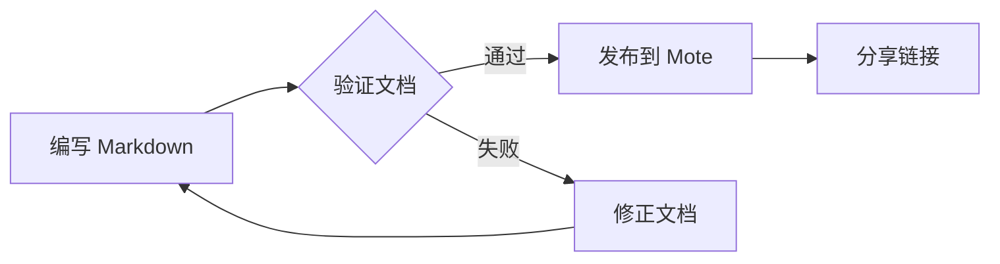
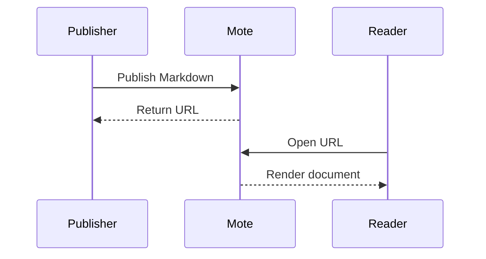
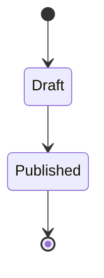
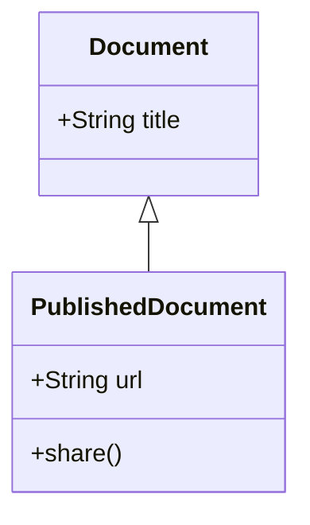

# Markdown 兼容性案例 / Compatibility specimen

This document combines supported features in one publishable page. Each numbered
section describes what to inspect. The opening metadata is hidden in Mote; the
page title comes from the heading above.

Publish this file from a checkout of the repository so its local image is available.
The [compatibility reference](https://github.com/flc1125/mote/blob/main/docs/markdown.md)
describes supported syntax and limits. This is a Mote specimen, not a promise that
all Markdown viewers render every extension identically.

## C01 · Emphasis and mixed languages

**说明：**中文标点后紧接正文，不需要人为补空格。

**阅读提示：**English text follows a Chinese label.

前文**“重点内容”**后文，前文**（补充说明）**后文。

**半角冒号:**中文正文。***重点：***加粗与斜体组合。

**嵌套 _斜体_ 和 `code`：**正文继续。

Ordinary **bold**, **bold with underscores**, _italic_, and ~~strikethrough~~.

[**链接：**说明](https://example.com) and an automatic URL: https://example.com.

Expected: emphasis inside links and nested formatting appear once, without stray
asterisks. The explicit escape `\*\*说明：\*\*` remains literal when written below:

\*\*说明：\*\*正文。

## C02 · Paragraphs, breaks and lists

These two source lines form
one paragraph with a soft break.

This line ends with a backslash.\
This line starts after an explicit hard break.

3. **第一步：**保留起始编号。
   - **子项：**保持嵌套。

   > **提示：**列表中的引用仍然可读。

4. **第二步：**检查任务列表。

- [x] **基础格式：**[链接](https://example.com) 和 `code`
- [ ] **待检查：**标签不得重复，复选框只读。

Expected: the ordered list starts at 3; the nested quote stays within its item;
task labels keep their inline formatting and cannot be toggled.

## C03 · Tables and inline formulas

| Item               | Expression | Quantity |
| :----------------- | :--------: | -------: |
| **说明：**中文内容 |  $E=mc^2$  |      100 |
| Escaped pipe a\|b  |   `x\|y`   |      200 |
| ~~Previous value~~ |            |        0 |

Expected: left, center and right alignment; literal pipes inside cells; an empty
cell; and a formula that does not break the table structure.

## C04 · GitHub-style alerts

> [!NOTE]
> **说明：**提示块保留中文加粗与 $x^2$ 行内公式。

> [!TIP]
>
> - Keep related details together.
> - Use `mermaid` fences for diagrams.

> [!IMPORTANT]
> Anyone with a published document's link can read it.

> [!WARNING]
> This is specimen text, not a live operational warning.

> [!CAUTION]
> Validate the source before publishing a permanent document.

Expected: five distinct alert titles and colors, readable in light and dark themes.

## C05 · Static syntax highlighting

```typescript
interface Document {
  title: string;
  published: boolean;
}

const document: Document = {
  title: 'Mote',
  published: true,
};
```

```json
{
  "name": "Mote",
  "features": ["markdown", "images", "math"]
}
```

```bash
# Explicit language selection; no automatic detection.
mote README.md --json
```

Expected: comments, strings and keywords have distinct colors. Selecting or copying
code preserves its text and line breaks.

## C06 · Local images and HTML combinations

The image below uses a percent-encoded local path. The CLI uploads the image; Mote
rewrites its reference to an opaque asset URL.


<details><summary>Inspect HTML, Markdown and a second image reference</summary>

**详情：**Markdown in this container is separated from the HTML tags by blank lines.

H<sub>2</sub>O, x<sup>2</sup>, <kbd>Ctrl</kbd> + <kbd>C</kbd> and <mark>highlighted text</mark>.

<p align="center"></p>

<table>
<thead><tr><th align="left">Label</th><th align="right">Value</th></tr></thead>
<tbody><tr><td>HTML table</td><td align="right">42</td></tr></tbody>
</table>

</details>

Expected: both image references resolve to the same uploaded asset. The disclosure
opens and closes, and the HTML table's numeric column remains right-aligned.

## C07 · Mathematics

Inline forms: $E=mc^2$ and \(\frac{a}{b}\). Ordinary prices remain text: $5 and $10.

$$
\int_0^1 x^2\,dx=\frac{1}{3}\qquad \sum_{i=1}^{n}i=\frac{n(n+1)}{2}
$$

\[
\begin{pmatrix}a & b \\ c & d\end{pmatrix}
\begin{pmatrix}x \\ y\end{pmatrix}=
\begin{pmatrix}ax+by \\ cx+dy\end{pmatrix}
\]

Expected: a fraction, integral, sum and matrix render as native MathML. No external
font or page script is needed. Code such as `$x$` remains code.

## C08 · Flowchart



Expected: five nodes and five directed connections, including the return to A.
Both compact edges (`D-->A`) and labeled edges must appear. The source disclosure
retains the original spacing.

## C09 · Sequence diagram



Expected: three participants and four messages, with distinct request/response lines.

## C10 · State diagram



Expected: start and end symbols, two named states and three transitions.

## C11 · Class diagram



Expected: both classes, their members and the inheritance connection are visible.
This is the fourth diagram in this page. ER and XY examples live in a
[separate specimen](https://github.com/flc1125/mote/blob/main/docs/examples/markdown-diagrams.md)
to stay within the per-document rendering budget.

## C12 · Footnotes and heading anchors

This sentence has a footnote[^review], and this one references it again[^review].

[^review]: **检查：**Both references have working return links.

Use the contents drawer to visit each of the following headings. Each gets its own
nonempty ID even when its text repeats or resembles an internal identifier.

### foo

First occurrence.

### foo

Second occurrence.

### foo-1

A natural numeric suffix.

### !!!

Punctuation-only heading.

### 🎉

Emoji-only heading.

### mote-toc

Heading text that resembles a reserved interface ID.

### fn1

Heading text that resembles a footnote ID.
