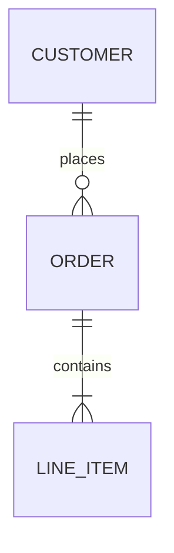
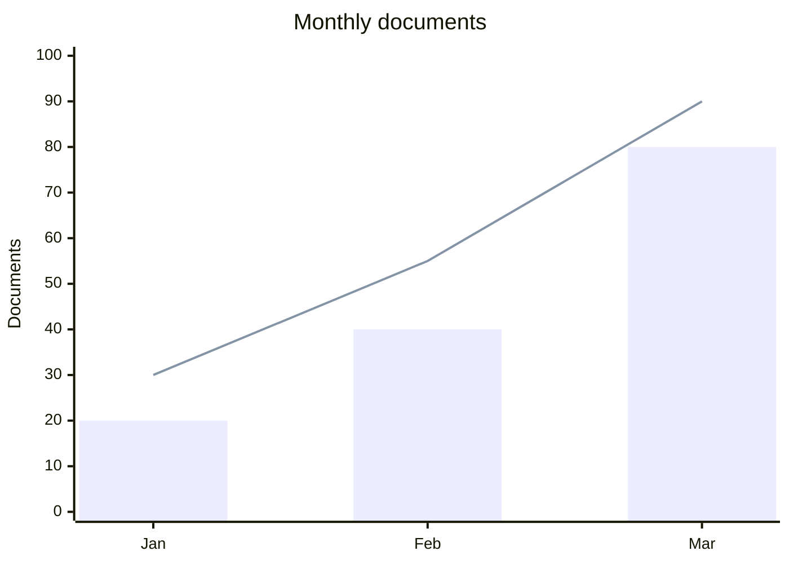
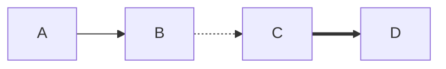
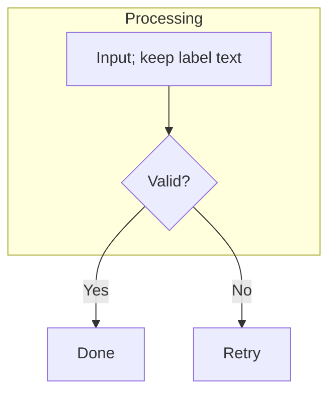

# Mermaid supplementary specimen

These examples complement the four diagrams in the
[main compatibility specimen](https://github.com/flc1125/mote/blob/main/docs/examples/markdown-compatibility.md).
Each section states the expected relationships, not just whether an SVG exists.

## D01 · Entity relationships

Expected: CUSTOMER, ORDER and LINE_ITEM are connected by two labeled relationships.
The cardinality symbols remain visible in both themes.

## D02 · Bars and lines

Expected: three bars and a line series, month labels, numeric ticks and a chart title.
The two series use distinct colors. Text and grid points remain visible in dark mode.

## D03 · Compact statements

Expected: four nodes connected by solid, dashed and thick edges. Semicolons separate
statements, and whitespace around arrows is optional.

## D04 · Labels and groups

Expected: A and B share a group; C and D are outside it. The semicolon inside the
quoted label is text, not a statement separator. Yes and No label different edges.

Large diagrams scroll within their region on narrow screens. The source disclosure
below each diagram keeps the original source available for inspection.
