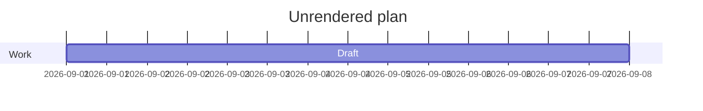
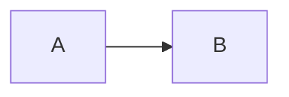

# Markdown fallback specimen

The intentionally invalid front matter above stays visible. Mote does not hide
ambiguous metadata or replace the heading with a metadata title.

## F01 · Literal syntax

Escaped emphasis: \*\*说明：\*\*正文。

Inline code: `$x$`, `**说明：**` and `<script>example()</script>`.

```unregistered-language
<example>Unknown code languages remain readable text.</example>
```

Expected: no execution, missing text or guessed syntax highlighting.

## F02 · Unknown alert

> [!CUSTOM]
> Unknown alert markers stay in an ordinary quote.

## F03 · Invalid formula

$\unknowncommand{x}$

Expected: the formula source remains visible with its delimiters.

## F04 · Unsupported diagram type



Expected: a source block with a fallback caption, not a partial diagram.

## F05 · Interactive diagram directive



Expected: source only. Static diagrams do not enable interactive links or custom
configuration. Size/count limits also fall back to source; automated regressions
cover those boundaries without adding oversized content to this specimen.
