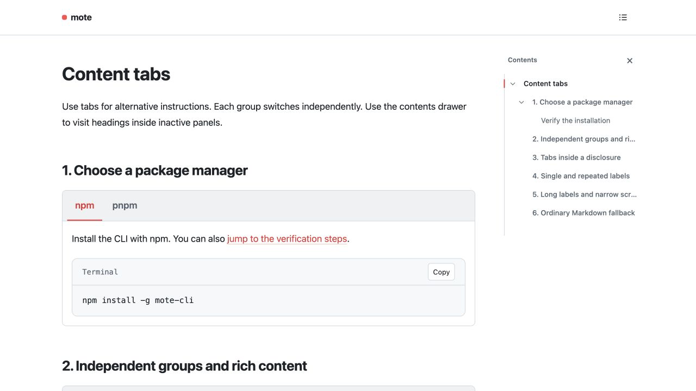

# Images and captions

Images keep their original asset URLs. Hover or focus a standalone large image to reveal its magnifier;
linked images and small inline icons retain their usual behavior.

## 1. A readable size and a visible caption

{ width="640" }
/// caption
**Content tabs** in a Mote document. The caption is visible; the image's alternative text describes the picture. [Read about tabs](../markdown.md#content-tabs).
///

Use the magnifier to open the screenshot, then, if it is scaled down to fit
the window, click the image to toggle its original size. The borderless viewer has only a close icon; Escape also closes it
and returns focus to the magnifier. On a narrow screen, the image fits the
column without horizontal page scrolling.

## 2. Percentage width and HTML figures

{ width="50%" }
/// caption
A separate caption at **50%** width. This reference shares the same uploaded asset.
///

<figure>

<figcaption>An HTML figure keeps its visible caption too.</figcaption>
</figure>

## 3. Links, icons and inline images

[{ width="160" }](https://github.com/flc1125/mote)

The linked logo opens the project. Inline icons like 
do not get an image viewer. The standalone small icon below also stays unchanged:


## 4. Images inside tabs and disclosures

=== "Overview"

    Switch to **Screenshot** to reveal another image.

=== "Screenshot"

    { width="480" }
    /// caption
    Assets from initially hidden panels are bundled too.
    ///

??? note "Show an image"

    { width="480" }
    /// caption
    A caption and viewer inside a native disclosure.
    ///

## 5. Literal examples and fallback

Unsupported image attributes remain visible as text:

{ width="200" class="custom" }

The following code is a syntax example, so its image is never uploaded:

```markdown
{ width="640" }
/// caption
A **visible** caption.
///
```

With scripting disabled, all images and captions remain readable. Printing omits
the viewer controls and includes content from hidden tabs and disclosures.
