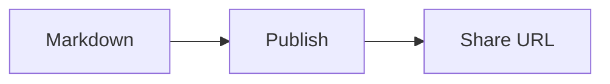

# Markdown compatibility

Mote renders CommonMark-style Markdown with selected GFM and document extensions.
The supported format is defined below; Mote does not claim complete compatibility
with every Markdown editor or every Mermaid feature.

Published Markdown and document IDs stay unchanged. Server-side rendering produces
static HTML, MathML and sanitized diagram SVG. Fixed scripts, authorized by exact
CSP hashes, provide browser-local history and enhance the table of contents on
pages with headings. Document content cannot execute scripts, and static
contents links remain usable when JavaScript is disabled.

## Recent history

Click **History** in a document header to reopen one of the last 20 documents
viewed in this browser. The list opens over the current page, shows titles in
latest-visit order and moves repeated visits to the top. Documents without headings
use the source filename. Click outside or press Escape to close the list.

**Record history** is on by default. Turning it off stops new records while keeping
existing visits available. Turning it back on records the current document and
resumes recording. The switch preference persists in this browser across reloads.
**Clear** removes the list without changing the switch or deleting publications;
when recording is on, the next document visit starts a new list.

History entries contain only document IDs and titles (up to 300 characters); the
recording preference is stored separately. Both stay in the current browser profile
and site. There is no server index, device sync, separate history page or homepage
entry. Others using the same browser profile can view these links. Clearing site
data removes history and resets recording to on. JavaScript or storage restrictions
may make history unavailable without blocking reading.

## Support matrix

| Feature                                          | Support                     | Behavior                                                                                     |
| ------------------------------------------------ | --------------------------- | -------------------------------------------------------------------------------------------- |
| Headings, paragraphs, emphasis, quotes and lists | Supported                   | Includes nested content, ordered-list starts and explicit hard breaks.                       |
| Tables, strikethrough and automatic links        | Supported                   | Escaped pipes, alignment and inline formatting; wide content can scroll.                     |
| Task lists and footnotes                         | Supported                   | Read-only checkboxes; repeated footnote references have return links.                        |
| Chinese emphasis boundaries                      | Limited extension           | Double-asterisk emphasis next to CJK text or East Asian punctuation; details below.          |
| Local Markdown and HTML images                   | Supported                   | CLI uploads referenced assets, including encoded paths; identical assets are deduplicated.   |
| Presentational HTML                              | Allowlisted                 | Includes details/summary, picture, tables, kbd, sub and sup. Arbitrary HTML/CSS is excluded. |
| GitHub-style alerts                              | Supported at document level | NOTE, TIP, IMPORTANT, WARNING and CAUTION. Nested list/quote markers remain ordinary quotes. |
| Code highlighting                                | Selected languages          | Static coloring for explicitly named languages; otherwise escaped source.                    |
| YAML front matter                                | Conservative recognition    | Valid metadata at the start is hidden; malformed or ambiguous content stays visible.         |
| Mathematical formulas                            | TeX subset                  | Inline and display formulas rendered with KaTeX as native MathML.                            |
| Mermaid diagrams                                 | Static subset               | Six diagram families with rendering budgets; source remains inspectable.                     |
| MDX, Dataview and executable embeds              | Not supported               | No code execution or editor-specific runtime.                                                |
| Uploaded or raw HTML SVG                         | Not supported               | Generated diagram SVG has a separate sanitizer; it does not enable user SVG uploads.         |

## Publishable specimens

From a repository checkout, publish one of these files using your configured CLI:

```bash
mote docs/examples/markdown-compatibility.md
mote docs/examples/markdown-diagrams.md
mote docs/examples/markdown-fallbacks.md
```

Publishing requires an instance and publisher authorization; see the
[CLI reference](cli.md) and [authentication guide](authentication.md).

- [Main specimen](examples/markdown-compatibility.md): numbered checks for mixed
  prose, lists, tables, alerts, code, local images, HTML, formulas, four diagram
  types, footnotes and heading collisions.
- [Supplementary diagrams](examples/markdown-diagrams.md): ER, XY, compact edge
  syntax and groups. Kept separate to respect the per-document diagram budget.
- [Fallback specimen](examples/markdown-fallbacks.md): invalid metadata, unknown
  languages and alerts, invalid formulas and unsupported diagrams.

Each specimen states the expected result. GitHub's own preview can differ from
Mote; publish the source to inspect Mote's rendering. Do not replace these synthetic
cases with private documents or private sharing URLs.

Reference captures from Chrome: [desktop](assets/markdown-compatibility-desktop.png),
[mobile viewport](assets/markdown-compatibility-mobile.png) and
[dark charts](assets/markdown-compatibility-dark.png). These illustrate one browser
and font environment; the numbered expectations define the checks.

## Chinese emphasis and line breaks

Mote accepts a limited extension to double-asterisk emphasis: punctuation next to
Chinese, Japanese or Korean text, and East Asian punctuation or quotation marks,
may open or close emphasis without added spaces:

```markdown
**说明：**后续正文
**阅读提示：**English text
前文**“重点”**后文
**说明:**中文正文
***重点：***正文
```

This extends CommonMark's punctuation boundary rules. Native delimiter pairing
still handles nesting and unmatched markers. Escapes, code, link destinations and
HTML attributes retain their original interpretation. Single asterisks, underscores
and ASCII-only cases such as `**English:**Next` retain standard behavior.

Ordinary line breaks remain soft breaks. Use two trailing spaces or a backslash for
an explicit hard break. Task-list labels preserve parsed emphasis, links and inline
code exactly once; checkboxes remain read-only.

## Heading links

Ordinary heading IDs retain their spelling. Repeated headings and headings with
numeric suffixes receive globally unique IDs. Punctuation-only and emoji-only
headings use `section`, with a suffix when needed. IDs used by the contents drawer,
footnotes and task checkboxes are reserved. Diagram-local references are isolated
from these IDs.

The contents drawer links to the allocated IDs. Links to previously ambiguous or
empty IDs may change; normal existing heading links are preserved.

## Images and HTML

Local image references are resolved relative to the Markdown file by the CLI.
Unicode, spaces, parentheses and percent-encoded paths are supported. An existing
manifest's exact reference takes precedence over decoded alternatives, preserving
historical filenames containing literal percent signs.

Only images are bundled. A link to another local Markdown file does not publish
that file; use a published URL when readers need to open another document.
Remote images retain their remote URLs and depend on the remote host's availability.

HTML passes through an allowlist. Scripts, event handlers, iframes, arbitrary
style/class/id attributes and active embeds are removed. Put blank lines around
Markdown inside `details` containers; arbitrary HTML blocks are not recursively
reinterpreted as Markdown.

## Alerts

Place a standalone marker on the first quoted line:

```markdown
> [!NOTE]
> **说明：**Alert content can contain formatting, lists and code.
```

The five markers are case-insensitive. Unknown markers, escaped markers and markers
nested inside a list or another quote stay ordinary quoted text. Alerts inside an
HTML disclosure follow the same Markdown blank-line rules as other content.

## Code highlighting

Specify a fence language. Mote registers Bash, C, C++, CSS, Diff, Go, Java,
JavaScript, JSON, Markdown, Python, Rust, SQL, TypeScript, XML/HTML and YAML, including
those grammars' aliases such as `sh`, `js`, `ts` and `html`. Names are case-insensitive.
There is no language auto-detection.

Unknown languages, rendering errors and budget overruns keep readable escaped code.
Highlighting adds colors without changing code text or line breaks.

## Front matter

A YAML block is hidden only when it starts the document, closes with `---`, is a
valid mapping, fits the recognition budget and contains a recognized metadata key.
Recognized keys include title, description, summary, author/authors, date,
created/updated/published, draft, tags/categories/keywords, layout, slug, permalink,
aliases, lang/language and cover/image. Additional keys may accompany them.

Unknown-only mappings, invalid YAML, duplicate keys, YAML aliases, custom tags and
unclosed blocks remain visible. Metadata never overrides the page title from the
body heading, runs templates, or triggers an upload for images mentioned only in
hidden metadata. The original source is still stored unchanged.

## Mathematics

Use `$...$` or `\(...\)` inline, and `$$...$$` or `\[...\]` for a display block.
Display blocks must occupy their own lines; their contents may span multiple lines.

```markdown
Energy: $E=mc^2$ and a ratio: \(\frac{a}{b}\).

$$
\sum_{i=1}^{n}i=\frac{n(n+1)}{2}
$$
```

Dollar delimiters use conservative whitespace and adjacency rules to avoid common
currency mistakes such as `$5 and $10`. Use `\(...\)` when dollar syntax is ambiguous.
Escaped dollars and formulas inside code remain text. Inline formulas cannot span
source lines.

Supported TeX is the subset accepted by the configured KaTeX renderer, not a full
LaTeX document engine. Invalid or oversized formulas remain escaped source. Macros
are isolated per formula; trusted HTML, links and image commands are disabled.
Native MathML avoids external fonts and scripts; formula typography can vary with
the browser and installed math fonts.

## Mermaid diagrams

A fence whose entire language label is `mermaid` enables static diagram rendering:



Supported families are `graph`/`flowchart`, `stateDiagram`/`stateDiagram-v2`,
`sequenceDiagram`, `classDiagram`, `erDiagram` and `xychart-beta`. Basic flowchart
arrows may omit surrounding spaces, and flowchart statements may use semicolons.
Node labels and source disclosures preserve the original text.

This uses a static Mermaid subset, not the full browser-based Mermaid engine.
Unsupported diagram families, configuration directives, interactive links and
arbitrary styling fall back to source. Other advanced syntax may differ from the
Mermaid reference renderer; inspect relationships and labels before publishing.
Each rendered diagram also includes a disclosure with its original source.

Diagrams adapt to the prose width on desktop and can scroll within their region on
narrow screens. Generated SVG is sanitized separately from user HTML; no remote
rendering service, page script or external font is required.

## Rendering budgets

These are processing limits, not publication size limits. Exceeding a rendering
budget keeps the affected source readable. Text counts use JavaScript string units;
see the README for Markdown and asset upload byte limits.

| Feature           | Per item                                                               | Per document                                                  |
| ----------------- | ---------------------------------------------------------------------- | ------------------------------------------------------------- |
| Front matter      | Closing delimiter within the first 16,384 text units                   | Opening block only                                            |
| Code highlighting | 16,384 input units; 4,096 per line; 262,144 output units               | 64 processed blocks; 65,536 input and 524,288 output units    |
| Mathematics       | 4,096 input units; 65,536 output units; 100 macro expansions           | 128 processed formulas; 16,384 input and 262,144 output units |
| Mermaid           | 4,096 input units; 64 lines; 256 word tokens; 262,144 SVG output units | Up to 4 diagram attempts, in source order                     |

Flowcharts and state diagrams additionally allow at most 32 nodes, 48 edges and
8 top-level groups. Rendered SVG dimensions must not exceed 5,000 units per side.
XY chart numeric literals are limited to magnitude 1,000,000 and six decimal places;
scientific notation is outside this subset. Invalid attempts can consume the
per-document budget before later content is reached.

Diagram layout runs in the Viewer on cache misses. These bounds limit work but do
not guarantee that every supported input fits every hosting plan's CPU allowance.
Check representative documents and cache-miss CPU usage on your instance during
rollout; local wall-clock measurements are not production CPU measurements.

## Regression coverage

Tests read the committed specimens directly and check their rendered structures,
image mappings and original source. Additional focused regressions cover delimiter
protection, duplicate anchors, sanitizer boundaries, encoded image paths, invalid
formulas, compact diagram edges and size/count limits. Browser acceptance checks
cover visual layout and controls separately from structural tests.
