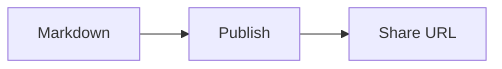

# Markdown compatibility

[简体中文](zh-CN/markdown.md)

Mote renders CommonMark-style Markdown with selected GFM and document extensions.
The supported format is defined below; Mote does not claim complete compatibility
with every Markdown editor or every Mermaid feature.

Published Markdown and document IDs stay unchanged. Server-side rendering produces
static HTML, MathML and sanitized diagram SVG. Fixed scripts, authorized by exact
CSP hashes, enhance navigation, code copying, image viewing and footnote previews where needed.
Document content cannot execute scripts; static contents links and readable code
remain available when JavaScript is disabled.

## Support matrix

| Feature                                          | Support                     | Behavior                                                                                                                                                                                                       |
| ------------------------------------------------ | --------------------------- | -------------------------------------------------------------------------------------------------------------------------------------------------------------------------------------------------------------- |
| Headings, paragraphs, emphasis, quotes and lists | Supported                   | Includes nested content, ordered-list starts and explicit hard breaks.                                                                                                                                         |
| Tables, strikethrough and automatic links        | Supported                   | Escaped pipes, alignment and inline formatting; wide content can scroll. Absolute http(s) links open in a new tab; fragments and relative links stay in-page. Raw HTML links keep the author's own attributes. |
| Task lists and footnotes                         | Supported                   | Read-only checkboxes; footnote previews retain full notes and return links.                                                                                                                                    |
| Highlights and definition lists                  | Supported                   | `==text==` and term/definition blocks; rendered as static semantic HTML.                                                                                                                                       |
| Abbreviations                                    | Bounded enhancement         | Document-local definitions produce static, case-sensitive abbreviation hints.                                                                                                                                  |
| Chinese emphasis boundaries                      | Limited extension           | Double-asterisk emphasis next to CJK text or East Asian punctuation; details below.                                                                                                                            |
| Local Markdown and HTML images                   | Supported                   | CLI uploads referenced assets, including encoded paths; identical assets are deduplicated.                                                                                                                     |
| Image widths, captions and viewing               | Bounded enhancement         | Explicit widths and image-only captions; image viewing keeps a static fallback.                                                                                                                                |
| Presentational HTML                              | Allowlisted                 | Includes details/summary, picture, tables, kbd, sub and sup. Arbitrary HTML/CSS is excluded.                                                                                                                   |
| GitHub-style alerts                              | Supported at document level | NOTE, TIP, IMPORTANT, WARNING and CAUTION. Nested list/quote markers remain ordinary quotes.                                                                                                                   |
| Extended admonitions                             | Bounded enhancement         | Custom titles, seven types, nested content and native folding with `!!!`, `???` and `???+`.                                                                                                                    |
| Content tabs                                     | Bounded enhancement         | Independent groups, keyboard switching, linkable panels and a complete static reading fallback.                                                                                                                |
| Code highlighting                                | Selected languages          | Static coloring for explicitly named languages; otherwise escaped source.                                                                                                                                      |
| Code titles, line numbers and copying            | Bounded enhancement         | Optional titles and physical-line emphasis; browser copy controls exclude decorative text.                                                                                                                     |
| YAML front matter                                | Conservative recognition    | Valid metadata at the start is hidden; malformed or ambiguous content stays visible.                                                                                                                           |
| Mathematical formulas                            | TeX subset                  | Inline and display formulas rendered with KaTeX as native MathML.                                                                                                                                              |
| Mermaid diagrams                                 | Static subset               | Six diagram families with rendering budgets; source remains inspectable.                                                                                                                                       |
| MDX, Dataview and executable embeds              | Not supported               | No code execution or editor-specific runtime.                                                                                                                                                                  |
| Uploaded or raw HTML SVG                         | Not supported               | Generated diagram SVG has a separate sanitizer; it does not enable user SVG uploads.                                                                                                                           |

## Publishable specimens

From a repository checkout, publish one of these files using your configured CLI:

```bash
mote docs/examples/markdown-compatibility.md
mote docs/examples/markdown-diagrams.md
mote docs/examples/markdown-fallbacks.md
mote docs/examples/markdown-admonitions.md
```

Publishing requires an instance and publisher authorization; see the
[CLI reference](cli.md) and [authentication guide](authentication.md).

- [Code blocks](examples/markdown-code-blocks.md): titles, line numbers, highlighted lines, copying and invalid metadata.
- [Images](examples/markdown-images.md): widths, captions, nested images, image viewing and fallbacks.
- [Abbreviations and footnote previews](examples/markdown-reading.md): word boundaries, repeated references, rich notes and static fallbacks.
- [Highlights and definition lists](examples/markdown-typography.md): inline boundaries, rich definitions and mixed components.
- [Content tabs](examples/markdown-tabs.md): alternatives, independent groups, nested disclosures and static fallbacks.
- [Admonitions](examples/markdown-admonitions.md): ordinary alerts, titles, nesting, folding and bundled images.
- [Main specimen](examples/markdown-compatibility.md): numbered checks for mixed
  prose, lists, tables, alerts, code, local images, HTML, formulas, four diagram
  types, footnotes and heading collisions.
- [Supplementary diagrams](examples/markdown-diagrams.md): ER, XY, compact edge
  syntax and groups. Kept separate to respect the per-document diagram budget.
- [Fallback specimen](examples/markdown-fallbacks.md): invalid metadata, unknown
  languages and alerts, invalid formulas and unsupported diagrams.

Each specimen states the expected result. GitHub's own preview can differ from
Mote; publish the source to inspect Mote's rendering. Do not replace these synthetic
cases with private documents or private sharing URLs.

Reference captures from Chrome: [desktop](assets/screenshots/markdown-compatibility-desktop.png),
[mobile viewport](assets/screenshots/markdown-compatibility-mobile.png) and
[dark charts](assets/screenshots/markdown-compatibility-dark.png). These illustrate one browser
and font environment; the numbered expectations define the checks.

See the [screenshot inventory](assets/screenshots/README.md) for capture sources,
dimensions and the [theme menu preview](assets/screenshots/markdown-theme-menu-dark.png).

## Chinese emphasis and line breaks

Mote accepts a limited extension to double-asterisk emphasis: punctuation next to
Chinese, Japanese or Korean text, and East Asian punctuation or quotation marks,
may open or close emphasis without added spaces:

```markdown
**说明：**后续正文
**阅读提示：**English text
前文**“重点”**后文
**说明:**中文正文
***重点：***正文
```

This extends CommonMark's punctuation boundary rules. Native delimiter pairing
still handles nesting and unmatched markers. Escapes, code, link destinations and
HTML attributes retain their original interpretation. Single asterisks, underscores
and ASCII-only cases such as `**English:**Next` retain standard behavior.

Ordinary line breaks remain soft breaks. Use two trailing spaces or a backslash for
an explicit hard break. Task-list labels preserve parsed emphasis, links and inline
code exactly once; checkboxes remain read-only.

## Highlights and definition lists

Use paired equals signs to highlight a phrase:

```markdown
This is an ==important conclusion==.
这是==需要注意的结论==。
Highlights can include ==**Strong text**, `inline code` and [a link](https://example.com)==.
```

The opening pair must touch non-whitespace text, as must the closing pair.
Delimiter pairing follows CommonMark emphasis boundaries; the special CJK
punctuation rules for `**` do not extend to `==`. Highlights may span a soft
line break within one paragraph. Escape the equals signs (`\==literal\==`) or
use code to display them literally. Empty, unmatched or whitespace-adjacent
markers stay as text. Longer runs pair up: `===word===` leaves one literal
equals sign at either end of the highlight. Setext heading lines keep their
normal meaning. Code, mathematical source, link destinations and HTML
attributes do not interpret highlight syntax.

A definition list pairs a one-line term with one or more explanations:

```markdown
Capability URL
: A link that grants access to a document.
: Keep it private when the document is private.

Document bundle

: Source Markdown and its referenced images.

    A second paragraph, indented four spaces.

    - Markdown lists, images, code and formulas can appear here.
```

Use `:` followed by whitespace and the explanation; `~` is also accepted as a
marker. A marker on its own creates an empty definition. A term may be followed
immediately by its first definition or separated by one blank line. Multiple
blank lines or a multiline term remain ordinary Markdown. Use four spaces for
additional paragraphs and nested blocks; the parser also accepts two-space
continuations. Relative to the definition body, additional code indentation
still creates a code block, so image examples in code are not uploaded.

Definitions can appear inside ordinary lists, quotes, footnotes, admonitions
and tab panels. Nested definition lists work; new admonitions and tabs are not
activated inside definition bodies. Their markers follow ordinary Markdown
there. Image widths and captions remain available within definitions.

Both features render on the server and work without JavaScript, in dark mode
and in print. The [typography specimen](examples/markdown-typography.md) shows
mixed content and literal fallbacks. Reference captures: [desktop](assets/screenshots/markdown-typography-desktop.png), [narrow viewport](assets/screenshots/markdown-typography-mobile.png) and [dark theme](assets/screenshots/markdown-typography-dark.png).

## Abbreviations

Define a term once, on an unindented line at document level. Separate the definitions
from surrounding paragraphs with a blank line:

```markdown
HTML documents can use an API. The API is documented separately.

*[HTML]: HyperText Markup Language
*[API]: Application Programming Interface
```

Definitions apply throughout the document, including text before the definition.
The first valid definition wins. Terms are case-sensitive and match whole words:
`API` matches `(API)` but not `APIs`, `API_value`, `中文API` or `API中文`.
Whitespace and punctuation separate Chinese terms too. When terms overlap, the
longest match is tried first. Titles are single-line plain text, not Markdown.
Terms cannot have outer whitespace, square brackets or backslashes.

Code, formulas, links, image alt text and asset paths are not replaced. An inline
block containing raw HTML is left unchanged. Definitions inside lists, quotes,
footnotes or components remain ordinary Markdown. Escape the opening asterisk
(`\*[API]: explanation`) to show a declaration; use code to show a term literally.

Each document accepts up to 64 terms (64 UTF-16 units each), titles of 512 units,
and 16,384 units of definition source. Matching processes up to 65,536 text units,
4,096 candidates and 512 replacements; remaining content stays ordinary text.
Invalid or over-budget definitions follow ordinary Markdown rules.

Abbreviations render as static `<abbr title="…">` with a dotted underline. Hover
hints depend on the browser and are not consistently available on touch devices,
with keyboards or in print. Put essential explanations in the prose or a
[definition list](#highlights-and-definition-lists).

## Footnotes and previews

Use a reference in the text and its definition elsewhere in the document:

```markdown
A claim with a note.[^source] The same note can be cited again.[^source]

[^source]: The supporting explanation.

    An additional paragraph, indented four spaces.
```

Click or tap a reference, or focus it and press Enter, to open a preview on
browsers with native Popover support. Escape or the close button returns focus to
that reference. Clicking outside or moving focus out closes the preview.
**Go to footnote** follows the original link to the complete note. Each return
arrow leads to its own reference, revealing its tab or disclosure when needed.
Modified clicks retain normal browser link behavior.

Long previews scroll. Text, lists, tables, links and images remain readable;
code is shown without copy controls or line numbers. The preview is a static
copy, so tabs and disclosures inside a note are flattened. Formulas, diagrams,
unsupported content and oversized notes use the original footnote link instead.
Only the first 64 references are enhanced; each preview is limited to 1,024 DOM
nodes, depth 32, 16,384 text/attribute units and eight images.

The full footnotes and return links always remain at the end of the document.
Without JavaScript or Popover support, references navigate there directly.
Printing uses the full notes and hides the preview. See the
[reading specimen](examples/markdown-reading.md) for short, repeated, rich and
long notes, plus references inside tabs and disclosures. Reference captures:
[desktop](assets/screenshots/markdown-reading-desktop.png), [narrow viewport](assets/screenshots/markdown-reading-mobile.png)
and [dark theme](assets/screenshots/markdown-reading-dark.png).

## Heading links

Ordinary heading IDs retain their spelling. Repeated headings and headings with
numeric suffixes receive globally unique IDs. Punctuation-only and emoji-only
headings use `section`, with a suffix when needed. IDs used by the contents drawer,
footnotes and task checkboxes are reserved. Diagram-local references are isolated
from these IDs.

The contents drawer links to the allocated IDs. Links to previously ambiguous or
empty IDs may change; normal existing heading links are preserved.

Every heading carries a section anchor that appears on hover or focus (always
visible on touch devices). With JavaScript and clipboard access, clicking it
copies the absolute `/{document-id}#section` URL and briefly shows a checkmark,
without navigating. Otherwise the anchor is a plain in-page link, so the
address bar picks up the same link. Anchors are hidden when printing.

The banner's **Copy Markdown source** button copies the original document text,
including front matter, comments, code fences, footnotes and content inside tabs
or disclosures. Image paths are preserved as written; relative paths may not work
when pasted elsewhere. Success briefly shows a checkmark and confirmation. If
clipboard access is unavailable or denied, a read-only source dialog allows manual
selection and copying; close it with Escape or the close button. The control needs
JavaScript and is omitted from print. Source text is available to readers even when
some of it is not displayed in the rendered article.

## Images and HTML

Local image references are resolved relative to the Markdown file by the CLI.
Unicode, spaces, parentheses and percent-encoded paths are supported. An existing
manifest's exact reference takes precedence over decoded alternatives, preserving
historical filenames containing literal percent signs.

Only images are bundled. A link to another local Markdown file does not publish
that file; use a published URL when readers need to open another document.
Remote HTTP(S) images retain their URLs, are not downloaded into the bundle and depend on the remote host's content and availability. `--no-assets` skips local-image uploads while preserving the source references; those images generally will not resolve for online readers.

Protocol-relative image URLs such as `//example.com/image.png`, including slash/backslash variants, are rejected in Markdown images and HTML `src`/`srcset`. Use an explicit URL such as `https://example.com/image.png`. Normal relative asset references and same-origin asset URLs are supported.

HTML passes through an allowlist. Scripts, event handlers, iframes, arbitrary
style/class/id attributes and active embeds are removed. Put blank lines around
Markdown inside `details` containers; arbitrary HTML blocks are not recursively
reinterpreted as Markdown.

### Image sizes, captions and viewing

Append `{ width="640" }` directly to an image to set its width in CSS pixels, or
use `{ width="50%" }` relative to the containing column. Height stays proportional;
images never exceed the available width. Only `width` is accepted: a decimal
integer from 1–4096 or a percentage from 1–100, in double quotes. The attribute
tail is limited to 64 UTF-16 units. Spaces before the braces, duplicate/unknown
fields and invalid values leave the tail visible as ordinary text.

```markdown
{ width="640" }
/// caption
A **visible caption** with a [source link](https://example.com).
///
```

Place the image on its own line, followed immediately by `/// caption`, 1–32
nonblank caption lines, and a closing `///`. Separate the whole block from other
paragraphs with blank lines. Captions support inline Markdown, including links;
they are not general block containers. Reference-style images work too. Captions
remain distinct from alternative text and the optional image tooltip. HTML
`figure`/`figcaption` remains available.

Caption processing is bounded: image line 4,096 UTF-16 units, caption 4,096,
complete paragraph 8,192; at most 64 candidate paragraphs and 65,536 units per
document. Attempts consume the budget even when invalid. Unsupported or oversized
structures follow ordinary Markdown rules.

Loaded standalone large images offer a magnifier in browsers with native dialog
support. It appears on hover or keyboard focus, and stays visible on touch devices.
The borderless viewer shows the image and a close icon. When multiple images are available, previous/next arrows and a position counter appear; Left/Right keys also navigate between images. When the image is scaled down to fit the window, click it or press
Enter/Space while it is focused to switch between original size and fitting the
window. Images already displayed at original size have no extra zoom interaction. Click the empty backdrop or press Escape to close and restore focus. Enlarged images scroll with
keyboard or native touch scrolling; browser zoom remains available. Linked images,
inline images, small icons, `picture` and `srcset` images retain their original
behavior. At most 64 eligible candidates receive controls. Without JavaScript,
images and captions remain readable with the browser's native image actions.
Printing omits viewer controls. A failed image retains its alternative text.

The first Markdown image keeps default eager loading; later Markdown images use
native lazy loading, and all decode asynchronously. This is a document-order
heuristic, not viewport detection. Raw HTML images keep browser defaults. Remote
images and the viewer reuse the original URLs without a proxy or a separate upload.
For different light/dark artwork, use the existing `picture`/`source media` markup;
URL-fragment shortcuts are not interpreted.

Try the [published image specimen](https://mote.pub/qAMkdNwYPKfvy8Yi) ([source](examples/markdown-images.md)) for widths, captions,
linked images and images inside tabs and disclosures. Screenshots: [desktop](assets/screenshots/markdown-images-desktop.png), [narrow viewer with image navigation](assets/screenshots/markdown-images-mobile.png), [dark page](assets/screenshots/markdown-images-dark.png).

## Alerts

### Ordinary notes

For a simple note, place a standalone marker on the first quoted line:

```markdown
> [!NOTE]
> **说明：**Alert content can contain formatting, lists and code.
```

The five markers are `NOTE`, `TIP`, `IMPORTANT`, `WARNING` and `CAUTION`, and are case-insensitive. Unknown markers, escaped markers and markers
nested inside a list or another quote stay ordinary quoted text. Alerts inside an
HTML disclosure follow the same Markdown blank-line rules as other content.

### Custom titles

Use `!!!` when a note needs a custom title or nested content. It uses the same
colors and icons as a GitHub-style alert:

```markdown
!!! warning "Back up before upgrading"

    Save the current configuration before changing it.
```

The seven supported types are `note`, `tip`, `important`, `warning`, `caution`,
`example` and `success`. These names are lowercase and case-sensitive. Omitting the
title uses the type's label; `!!! tip ""` hides the title row. Titles are plain text,
not Markdown or HTML. Double quotes are required; only `\"` and `\\` escapes are
accepted.

Put a blank line after the opener and indent every nonblank body line with four
spaces relative to it. The opener must start at column zero of the document or its
containing admonition or tab panel. Body content supports ordinary Markdown, including lists,
images, tables, code, math, footnotes and other admonitions. Local images inside
closed blocks are bundled like visible images. Code and math examples remain
literal and do not upload images.

### Foldable content

Use `???` for a block that starts closed or `???+` for one that starts open:

```markdown
??? tip "Show the command"

    Run `mote auth status --offline` to check the selected instance.

???+ success "Checks completed"

    The document is ready to share.
```

Readers toggle these native disclosures by clicking the title or using Enter or
Space while it has keyboard focus. Folding works without JavaScript. A missing,
empty or whitespace-only disclosure title uses the type's label so the control
stays named. Native HTML `<details><summary>…</summary>…</details>` uses the same
tinted title band and page-colored body, preserving its summary content and `open`
attribute. Printing includes the folded body as well as the title for both forms.

With JavaScript enabled, following a link to a heading inside a closed block opens
its enclosing disclosures before positioning the page. This works with the table
of contents and browser back/forward navigation. Heading-free blocks also receive
unique IDs such as `mote-admonition-1`; prefer heading links when a section has a
heading, since inserting earlier components can change generated component IDs.
Without JavaScript, open closed ancestors manually to reach hidden content.

### Nesting and fallback

Indent each nested level by another four spaces:

```markdown
??? example "More information"

    !!! note "Before you begin"

        Keep the document and its images together.
```

New openers do not activate inside lists, blockquotes, footnote definitions, code,
math or raw HTML blocks, and cannot interrupt a paragraph. Existing GitHub markers
inside an admonition stay ordinary quotes. Unknown types, malformed titles,
missing blank lines, empty bodies and budget overruns follow ordinary Markdown
rules. That fallback can be a paragraph or indented code depending on the source;
it does not broadly reinterpret indented image examples as uploadable assets.

Publish the [admonition specimen](examples/markdown-admonitions.md) to try both
syntaxes, custom titles, nesting, image discovery and disclosure navigation.
Reference screenshots: [desktop](assets/screenshots/markdown-admonitions-desktop.png) and
[dark example disclosure](assets/screenshots/markdown-admonitions-dark.png).

## Content tabs

Use `=== "label"` for alternative instructions, such as package managers or platforms:

````markdown
=== "npm"

    ```sh
    npm install -g mote-cli
    ```

=== "pnpm"

    ```sh
    pnpm add -g mote-cli
    ```
````

Start each opener at column zero of the document or recognized component body.
Leave a blank line after it and indent every nonblank body line with four literal
spaces. Adjacent valid panels separated only by blank lines form one group; an
ordinary block ends the group. Labels are nonblank plain text in double quotes,
with only `\"` and `\\` escapes. Duplicate labels are allowed and receive distinct
links. A single panel is a readable section without switching controls.

Each group initially selects its first panel and switches independently. Click or
tap a label, or use Left/Right arrows, Home and End while a label has keyboard
focus. Tab moves into the active panel. Selections are not synchronized across
groups or remembered across pages.

Choosing a tab updates the URL with a panel anchor such as `#mote-tab-2`. Heading
links retain their ordinary IDs: following one reveals its panel and any closed
disclosures, including when using the contents drawer or browser back/forward.
Prefer heading links for durable references, since inserting earlier panels can
change generated panel IDs. Footnote return links also reveal their referring
panel. Without JavaScript, all panels and their linked labels stay visible; printing
includes every panel. Native disclosures still need manual expansion when scripts are disabled. If initialization fails, the affected group stays readable.

### Supported nesting

| Container                                                     | Admonitions (`!!!`, `???`, `???+`) | Tab groups |
| ------------------------------------------------------------- | ---------------------------------- | ---------- |
| Document body                                                 | Yes                                | Yes        |
| Admonition body, outside tabs                                 | Yes                                | Yes        |
| Tab panel body                                                | Yes                                | No         |
| Admonition anywhere inside a tab panel                        | Yes                                | No         |
| Lists, blockquotes, footnote definitions, code or math source | No                                 | No         |

HTML disclosures can surround Markdown components when blank lines allow Markdown
parsing. Raw HTML blocks themselves are not reparsed. Each tab group and each panel
counts as a component and a nesting level; these share the admonition budgets.
A group supports at most 16 panels. An over-budget group falls back as a whole;
invalid syntax follows ordinary Markdown rules. Images in every valid panel are
bundled, while image examples in fallback code are not uploaded. Code, tables,
math and diagrams retain their document-wide limits across panels.

Try the [content tabs specimen](examples/markdown-tabs.md) for independent groups,
folding, images, long labels and fallback examples. Screenshots: [desktop](assets/screenshots/markdown-tabs-desktop.png) and [narrow screen](assets/screenshots/markdown-tabs-mobile.png).

## Code highlighting

Specify a fence language. Mote registers Bash, C, C++, CSS, Diff, Go, Java,
JavaScript, JSON, Markdown, Python, Rust, SQL, TypeScript, XML/HTML and YAML, including
those grammars' aliases such as `sh`, `js`, `ts` and `html`. Names are case-insensitive.
There is no language auto-detection.

Unknown languages, rendering errors and budget overruns keep readable escaped code.
Highlighting adds colors without changing code text or line breaks.

### Code titles, line numbers and copying

Ordinary fenced code blocks provide a Copy button when the browser supports clipboard access. Copying preserves the Markdown parser's code text, including its trailing newline, without adding the title or line numbers. CRLF is normalized to LF by the parser; the uploaded source file remains unchanged. If clipboard access fails, select and copy the code manually. Without JavaScript, code, titles and line emphasis remain readable.

Add optional parameters after an explicit language (`text` for plain code):

````markdown
```ts title="config.ts" linenums="10" hl_lines="2-3"
const config = {
  timeout: 3000,
  retries: 2,
};
```
````

- `title`: a plain-text file name or label. An empty title is hidden.
- `linenums`: the starting display number; omitted by default.
- `hl_lines`: space-separated physical line numbers or inclusive ranges, counted from 1 regardless of `linenums`. Overlapping ranges merge; positions beyond the code are ignored.

Keys are case-sensitive and values require double quotes; only `\"` and `\\` escapes are accepted. Unknown or duplicate keys, invalid values or oversized metadata discard the entire parameter tail while preserving the language and code. Attribute lists and metadata without an explicit language are not supported. Indented code, raw HTML code and Mermaid fences do not receive title/line-number controls; rendered Mermaid diagrams instead have a copyable source disclosure. `mermaid title="..."` retains the existing source fallback.

Parameters are limited to 1,024 text units in total, titles to 240, and line numbers/range endpoints to positive integers up to 1,000,000 (at most 64 range items). Code controls and line decoration have separate budgets listed below. Empty code may show a title but has no copy control or line numbers. Long code scrolls within its block; print output wraps it and omits copy controls.

Publish the [code-block specimen](examples/markdown-code-blocks.md) to check titles, multiline highlighting, escaped markup, copying, folding and narrow-screen behavior.

## Front matter

A YAML block is hidden only when it starts the document, closes with `---`, is a
valid mapping, fits the recognition budget and contains a recognized metadata key.
Recognized keys include title, description, summary, author/authors, date,
created/updated/published, draft, tags/categories/keywords, layout, slug, permalink,
aliases, lang/language and cover/image. Additional keys may accompany them.

Unknown-only mappings, invalid YAML, duplicate keys, YAML aliases, custom tags and
unclosed blocks remain visible. Metadata never overrides the page title from the
body heading, runs templates, or triggers an upload for images mentioned only in
hidden metadata. The original source is still stored unchanged.

## Mathematics

Use `$...$` or `\(...\)` inline, and `$$...$$` or `\[...\]` for a display block.
Display blocks must occupy their own lines; their contents may span multiple lines.

```markdown
Energy: $E=mc^2$ and a ratio: \(\frac{a}{b}\).

$$
\sum_{i=1}^{n}i=\frac{n(n+1)}{2}
$$
```

Dollar delimiters use conservative whitespace and adjacency rules to avoid common
currency mistakes such as `$5 and $10`. Use `\(...\)` when dollar syntax is ambiguous.
Escaped dollars and formulas inside code remain text. Inline formulas cannot span
source lines.

Supported TeX is the subset accepted by the configured KaTeX renderer, not a full
LaTeX document engine. Invalid or oversized formulas remain escaped source. Macros
are isolated per formula; trusted HTML, links and image commands are disabled.
Native MathML avoids external fonts and scripts; formula typography can vary with
the browser and installed math fonts.

## Mermaid diagrams

A fence whose entire language label is `mermaid` enables static diagram rendering:



Supported families are `graph`/`flowchart`, `stateDiagram`/`stateDiagram-v2`,
`sequenceDiagram`, `classDiagram`, `erDiagram` and `xychart-beta`. Basic flowchart
arrows may omit surrounding spaces, and flowchart statements may use semicolons.
Node labels and source disclosures preserve the original text.

This uses a static Mermaid subset, not the full browser-based Mermaid engine.
Unsupported diagram families, configuration directives, interactive links and
arbitrary styling fall back to source. Other advanced syntax may differ from the
Mermaid reference renderer; inspect relationships and labels before publishing.
Each rendered diagram also includes an icon-only disclosure at the frame corner with its original source and a copy button. The disclosure opens without JavaScript; the copy button requires JavaScript and clipboard access and is hidden in print.

Diagrams adapt to the prose width on desktop and can scroll within their region on
narrow screens. Generated SVG is sanitized separately from user HTML; no remote
rendering service, page script or external font is required.

## Rendering budgets

These are processing limits, not publication size limits. Exceeding a rendering
budget keeps the affected source readable. Text counts use JavaScript string units;
see the README for Markdown and asset upload byte limits.

| Feature           | Per item                                                                           | Per document                                                                    |
| ----------------- | ---------------------------------------------------------------------------------- | ------------------------------------------------------------------------------- |
| Front matter      | Closing delimiter within the first 16,384 text units                               | Opening block only                                                              |
| Code highlighting | 16,384 input units; 4,096 per line; 262,144 output units                           | 64 processed blocks; 65,536 input and 524,288 output units                      |
| Code enhancements | 16,384 input units; 512 lines; 32 KiB additional markup                            | 64 processed blocks; 65,536 input units; 4,096 lines; 256 KiB additional markup |
| Shared containers | 512 opener units; 160 title/label units; 8 nesting levels; 16 panels per tab group | 256 components; 131,072 source units, counting nested source once               |
| Mathematics       | 4,096 input units; 65,536 output units; 100 macro expansions                       | 128 processed formulas; 16,384 input and 262,144 output units                   |
| Mermaid           | 4,096 input units; 64 lines; 256 word tokens; 262,144 SVG output units             | Up to 4 diagram attempts, in source order                                       |

Flowcharts and state diagrams additionally allow at most 32 nodes, 48 edges and
8 top-level groups. Rendered SVG dimensions must not exceed 5,000 units per side.
XY chart numeric literals are limited to magnitude 1,000,000 and six decimal places;
scientific notation is outside this subset. Invalid attempts can consume the
per-document budget before later content is reached.

Diagram layout runs in the Viewer on cache misses. These bounds limit work but do
not guarantee that every supported input fits every hosting plan's CPU allowance.
Check representative documents and cache-miss CPU usage on your instance during
rollout; local wall-clock measurements are not production CPU measurements.

## Regression coverage

Tests read the committed specimens directly and check their rendered structures,
image mappings and original source. Additional focused regressions cover delimiter
protection, duplicate anchors, sanitizer boundaries, encoded image paths, invalid
formulas, compact diagram edges and size/count limits. Browser acceptance checks
cover visual layout and controls separately from structural tests.
