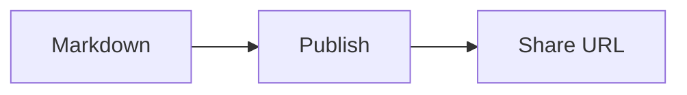

# Markdown 兼容性

[English](../markdown.md)

Mote 渲染 CommonMark 风格的 Markdown，并提供部分 GFM 和文档扩展。下文定义支持的格式；Mote 不承诺与所有 Markdown 编辑器或 Mermaid 功能完全兼容。

已发布的 Markdown 和文档 ID 保持不变。服务端渲染生成静态 HTML、MathML 和经过净化的图表 SVG。通过精确 CSP 哈希授权的固定脚本，按需增强目录导航与代码复制。文档内容不能执行脚本；禁用 JavaScript 后，静态目录链接和代码正文仍可使用。

## 支持矩阵

| 功能                         | 支持程度     | 行为                                                                           |
| ---------------------------- | ------------ | ------------------------------------------------------------------------------ |
| 标题、段落、强调、引用和列表 | 支持         | 包括嵌套内容、有序列表起始编号和显式硬换行。                                   |
| 表格、删除线和自动链接       | 支持         | 支持转义竖线、对齐与行内格式；宽内容可滚动。                                   |
| 任务列表与脚注               | 支持         | 复选框只读；重复脚注引用带返回链接。                                           |
| 中文强调边界                 | 有限扩展     | 支持紧邻 CJK 文本或东亚标点的双星号强调，详见下文。                            |
| Markdown 与 HTML 本地图片    | 支持         | CLI 上传引用的资产，包括编码路径；相同资产去重。                               |
| 展示类 HTML                  | 白名单       | 包括 details/summary、picture、表格、kbd、sub 和 sup；不支持任意 HTML/CSS。    |
| GitHub 风格提示块            | 支持文档层级 | NOTE、TIP、IMPORTANT、WARNING 和 CAUTION；列表或引用中的嵌套标记仍是普通引用。 |
| 扩展提示块                   | 有限增强     | 自定义标题、七种类型、嵌套内容，以及 `!!!`、`???` 和 `???+` 原生折叠。         |
| 代码高亮                     | 指定语言     | 显式指定支持的语言时静态着色，否则保留转义后的源码。                           |
| 代码标题、行号与复制         | 有限增强     | 可选标题与物理行强调；浏览器复制控件不包含装饰文字。                           |
| YAML front matter            | 保守识别     | 隐藏文档开头的有效元数据，格式错误或含义不明确的内容仍可见。                   |
| 数学公式                     | TeX 子集     | 用 KaTeX 将行内与块级公式渲染为原生 MathML。                                   |
| Mermaid 图表                 | 静态子集     | 支持六类图表，受渲染预算限制；仍可查看源码。                                   |
| MDX、Dataview 与可执行嵌入   | 不支持       | 不执行代码，不提供编辑器专用运行时。                                           |
| 上传 SVG 或原始 HTML SVG     | 不支持       | 生成的图表 SVG 使用独立净化器，不因此允许用户上传 SVG。                        |

## 可发布的验证示例

在仓库检出目录中，使用已配置的 CLI 发布以下任一文件：

```bash
mote docs/examples/markdown-compatibility.md
mote docs/examples/markdown-diagrams.md
mote docs/examples/markdown-fallbacks.md
mote docs/examples/markdown-admonitions.md
```

发布需要实例和发布者授权，参阅 [CLI 参考](cli.md)与[鉴权指南](authentication.md)。

- [提示块示例（英文）](../examples/markdown-admonitions.md)：普通提示、自定义标题、嵌套、折叠与图片打包。
- [主要示例（英文）](../examples/markdown-compatibility.md)：按编号检查混合正文、列表、表格、提示块、代码、本地图片、HTML、公式、四类图表、脚注与标题冲突。
- [补充图表（英文）](../examples/markdown-diagrams.md)：ER、XY、紧凑连线语法与分组。为遵守单文档图表预算，单独存放。
- [回退示例（英文）](../examples/markdown-fallbacks.md)：无效元数据、未知语言与提示块、无效公式和不支持的图表。

每份示例都说明预期结果。GitHub 预览可能与 Mote 不同，需发布源码来检查 Mote 的呈现。不要用私有文档或私有分享 URL 替换这些合成用例。

Chrome 参考截图：[桌面](../assets/markdown-compatibility-desktop.png)、[移动视口](../assets/markdown-compatibility-mobile.png)和[深色图表](../assets/markdown-compatibility-dark.png)。截图仅展示一种浏览器与字体环境；检查以编号列出的预期为准。

## 中文强调与换行

Mote 对双星号强调做了有限扩展：紧邻中文、日文或韩文的标点，以及东亚标点或引号，可以在不添加空格的情况下开启或闭合强调：

```markdown
**说明：**后续正文
**阅读提示：**English text
前文**“重点”**后文
**说明:**中文正文
***重点：***正文
```

这扩展了 CommonMark 的标点边界规则。嵌套与未配对标记仍由原生分隔符配对逻辑处理。转义、代码、链接目标和 HTML 属性保留原有解释。单星号、下划线，以及 `**English:**Next` 等纯 ASCII 情况遵循标准行为。

普通换行仍是软换行。显式硬换行使用行尾两个空格或反斜杠。任务列表标签中的强调、链接和行内代码按解析结果保留，且只处理一次；复选框仍为只读。

## 标题链接

普通标题 ID 保留其原有写法。重复标题和带数字后缀的标题会获得全局唯一 ID。仅含标点或 emoji 的标题使用 `section`，必要时添加后缀。目录抽屉、脚注与任务复选框所用 ID 为保留值；图表内部引用与这些 ID 隔离。

目录抽屉链接到分配后的 ID。此前有歧义或为空的 ID 对应链接可能改变，普通已有标题链接会保留。

## 图片与 HTML

CLI 相对于 Markdown 文件解析本地图片引用，支持 Unicode、空格、括号和百分号编码路径。已有 manifest 的精确引用优先于解码后的候选路径，以保留历史文件名中的字面百分号。

仅图片会打包。指向另一篇本地 Markdown 文件的链接不会发布该文件；读者需要访问其他文档时，使用已发布 URL。远程 HTTP(S) 图片保留原 URL，不下载进文档包，并依赖远程主机的内容和可用性。`--no-assets` 跳过本地图片上传，但保留源码引用；这些图片通常无法供在线读者访问。

Markdown 图片与 HTML `src`/`srcset` 会拒绝 `//example.com/image.png` 等协议相对图片 URL，包括正斜杠/反斜杠变体。请使用 `https://example.com/image.png` 等显式 URL。普通相对资产引用与同源资产 URL 仍受支持。

HTML 经过白名单过滤。脚本、事件处理器、iframe、任意 style/class/id 属性和可执行嵌入都会移除。在 `details` 容器中的 Markdown 前后留出空行；任意 HTML 块不会递归重新解释为 Markdown。

## 提示块

### 普通提示

简单提示可以在引用的第一行单独放置标记：

```markdown
> [!NOTE]
> **说明：**Alert content can contain formatting, lists and code.
```

支持 `NOTE`、`TIP`、`IMPORTANT`、`WARNING` 和 `CAUTION` 五种标记，不区分大小写。未知标记、转义标记，以及嵌套在列表或其他引用中的标记，仍显示为普通引用文本。HTML 折叠容器中的提示块与其他内容遵循相同的 Markdown 空行规则。

### 自定义标题

需要自定义标题或嵌套内容时，使用 `!!!`。它与 GitHub 风格提示共用颜色和图标：

```markdown
!!! warning "升级前先备份"

    修改配置前，先保存当前配置。
```

支持 `note`、`tip`、`important`、`warning`、`caution`、`example` 和 `success` 七种类型，必须使用小写，区分大小写。省略标题时显示类型名称；`!!! tip ""` 隐藏标题行。标题为纯文本，不解析 Markdown 或 HTML，必须使用双引号，仅接受 `\"` 和 `\\` 转义。

起始行后必须空一行，正文的每个非空行相对起始行缩进四个空格。起始行位于文档或父提示块正文的第零列。正文支持列表、图片、表格、代码、数学、脚注及其他提示块等 Markdown 内容。折叠块内的本地图片同样会被打包；代码和数学示例仍保留为字面文本，不触发图片上传。

### 折叠内容

`???` 默认收起，`???+` 默认展开：

```markdown
??? tip "查看命令"

    运行 `mote auth status --offline` 检查选中的实例。

???+ success "检查完成"

    文档已准备好分享。
```

读者可点击标题，或聚焦标题后按 Enter、空格键展开与收起。折叠使用浏览器原生控件，无需 JavaScript。折叠标题省略、为空或仅含空白时，使用类型名称，保证控件有可读名称。原生 HTML `<details><summary>…</summary>…</details>` 共用浅底色标题栏和跟随页面底色的正文，保留原有标题内容及 `open` 属性。两种写法在打印时都会显示标题和折叠正文。

启用 JavaScript 时，链接到折叠块内的标题会先展开所有必要的祖先，再定位页面，支持目录跳转与浏览器前进、后退。无标题的块也会分配 `mote-admonition-1` 等唯一 ID；若内容已有标题，优先链接标题，因为插入更早的组件可能改变自动组件 ID。禁用 JavaScript 时，需要手动展开祖先才能阅读隐藏内容。

### 嵌套与回退

每层嵌套再增加四个空格：

```markdown
??? example "更多信息"

    !!! note "开始之前"

        将文档与图片保存在一起。
```

新起始标记不会在列表、引用、脚注定义、代码、数学或原始 HTML 块内激活，也不能打断段落。提示块内的 GitHub 标记仍显示为普通引用。未知类型、非法标题、缺少空行、空正文或超出预算时，按普通 Markdown 规则处理，可能显示为段落或缩进代码；不会把所有缩进图片示例重新解释为可上传资产。

可发布[提示块验证示例（英文）](../examples/markdown-admonitions.md)，体验两种语法、自定义标题、嵌套、图片扫描与折叠定位。Chrome 参考截图：[桌面](../assets/markdown-admonitions-desktop.png)与[窄屏深色](../assets/markdown-admonitions-mobile.png)。

## 代码高亮

为围栏代码块指定语言。Mote 注册 Bash、C、C++、CSS、Diff、Go、Java、JavaScript、JSON、Markdown、Python、Rust、SQL、TypeScript、XML/HTML 和 YAML，也支持这些语法的 `sh`、`js`、`ts`、`html` 等别名。名称不区分大小写，不会自动检测语言。

未知语言、渲染错误或超出预算时，保留可读的转义代码。高亮只添加颜色，不改变代码文本或换行。

### 代码标题、行号与复制

浏览器支持剪贴板访问时，普通围栏代码块提供 Copy 按钮。复制保留 Markdown 解析后的代码文本及尾部换行，不包含标题或行号。解析器将 CRLF 规范化为 LF，上传的源文件保持不变。剪贴板访问失败时，可手动选中并复制代码。禁用 JavaScript 后，代码、标题和重点行仍可阅读。

在显式语言后添加可选参数（纯文本使用 `text`）：

````markdown
```ts title="config.ts" linenums="10" hl_lines="2-3"
const config = {
  timeout: 3000,
  retries: 2,
};
```
````

- `title`：纯文本文件名或标签；空标题不显示。
- `linenums`：显示行号的起点；默认不显示行号。
- `hl_lines`：用空格分隔的物理行号或闭区间，从 1 开始计数，不受 `linenums` 影响。重叠区间合并，超过代码实际行数的位置忽略。

键区分大小写，值必须使用双引号，仅接受 `\"` 和 `\\` 转义。未知键、重复键、非法值或超长元数据会使整个参数尾部被忽略，语言和代码仍保留。不支持属性列表及无显式语言的元数据写法。缩进代码、原始 HTML 代码、Mermaid 围栏和源码折叠区不添加这些控件；`mermaid title="..."` 保持既有源码回退行为。

参数尾部最多 1,024 个文本单位，标题最多 240 个，行号及区间端点为不超过 1,000,000 的正整数（最多 64 个区间项）。代码控件和行装饰使用下方列出的独立预算。空代码可显示标题，但不提供复制按钮或行号。长代码在块内滚动；打印时换行并隐藏复制控件。

可发布[代码块验证示例（英文）](../examples/markdown-code-blocks.md)，检查标题、多行高亮、转义文本、复制、折叠与窄屏效果。

## Front matter

YAML 块只有同时满足以下条件才会隐藏：位于文档开头、以 `---` 闭合、是有效映射、未超出识别预算，并包含已识别的元数据键。识别的键包括 title、description、summary、author/authors、date、created/updated/published、draft、tags/categories/keywords、layout、slug、permalink、aliases、lang/language 和 cover/image，允许同时包含其他键。

仅含未知键的映射、无效 YAML、重复键、YAML 别名、自定义标签和未闭合块仍可见。元数据不会覆盖正文标题决定的页面标题、执行模板，或触发仅在隐藏元数据中引用的图片上传。原始源码仍保持不变地存储。

## 数学公式

行内使用 `$...$` 或 `\(...\)`，块级使用 `$$...$$` 或 `\[...\]`。块级公式必须独占行，内容可跨多行。

```markdown
Energy: $E=mc^2$ and a ratio: \(\frac{a}{b}\).

$$
\sum_{i=1}^{n}i=\frac{n(n+1)}{2}
$$
```

美元符分隔语法使用保守的空白与相邻字符规则，避免将 `$5 and $10` 等常见货币文本误认作公式。美元符语法有歧义时，使用 `\(...\)`。转义美元符和代码中的公式保留为文本；行内公式不能跨源码行。

支持的 TeX 是当前 KaTeX 渲染器配置接受的子集，不是完整 LaTeX 文档引擎。无效或超大公式保留为转义源码。宏按公式隔离；受信任 HTML、链接与图片命令被禁用。原生 MathML 无需外部字体或脚本；公式排版可能随浏览器和已安装数学字体变化。

## Mermaid 图表

围栏代码块的完整语言标签为 `mermaid` 时，启用静态图表渲染：



支持 `graph`/`flowchart`、`stateDiagram`/`stateDiagram-v2`、`sequenceDiagram`、`classDiagram`、`erDiagram` 和 `xychart-beta`。基本流程图箭头可省略两侧空格，流程图语句可使用分号。节点标签和源码折叠区保留原始文本。

这里使用静态 Mermaid 子集，不是完整的浏览器 Mermaid 引擎。不支持的图表类型、配置指令、交互链接和任意样式会回退到源码。其他高级语法可能与 Mermaid 参考渲染器不同；发布前检查关系和标签。每张已渲染图表还提供可展开的原始源码。

桌面图表适应正文宽度，窄屏下可在图表区域内滚动。生成 SVG 的净化独立于用户 HTML，无需远程渲染服务、页面脚本或外部字体。

## 渲染预算

以下是处理限额，不是发布大小限额。超出渲染预算时，受影响的源码仍保持可读。文本计数使用 JavaScript 字符串单位；Markdown 和资产的上传字节限额见 [README](../../README.zh-CN.md#-限制)。

| 功能         | 单项                                                            | 单文档                                                     |
| ------------ | --------------------------------------------------------------- | ---------------------------------------------------------- |
| Front matter | 闭合分隔符位于前 16,384 个文本单位内                            | 仅文档开头的块                                             |
| 代码高亮     | 输入 16,384 单位；每行 4,096；输出 262,144 单位                 | 处理 64 个块；输入 65,536、输出 524,288 单位               |
| 代码增强     | 输入 16,384 单位；512 行；新增标记 32 KiB                       | 处理 64 个块；输入 65,536 单位；4,096 行；新增标记 256 KiB |
| 提示块       | 起始行 512 个文本单位；标题 160 个；嵌套最多 8 层               | 256 个组件；131,072 个源码单位，嵌套源码不重复计数         |
| 数学公式     | 输入 4,096 单位；输出 65,536 单位；100 次宏展开                 | 处理 128 个公式；输入 16,384、输出 262,144 单位            |
| Mermaid      | 输入 4,096 单位；64 行；256 个词法 token；SVG 输出 262,144 单位 | 按源码顺序最多尝试 4 张图表                                |

流程图和状态图还限制最多 32 个节点、48 条边和 8 个顶层分组。渲染 SVG 每边尺寸不得超过 5,000 单位。XY 图表数字字面量的绝对值不得超过 1,000,000，最多六位小数；此子集不支持科学计数法。无效尝试也可能在处理后续内容前消耗单文档预算。

图表布局在 Viewer 缓存未命中时运行。这些边界限制处理量，但不保证每种受支持输入都满足所有托管计划的 CPU 额度。上线时，在自己的实例检查代表性文档和缓存未命中的 CPU 用量；本地耗时不是生产 CPU 测量值。

## 回归覆盖

测试直接读取仓库中的验证示例，检查渲染结构、图片映射与原始源码。专项回归还覆盖分隔符保护、重复锚点、净化器边界、编码图片路径、无效公式、紧凑图表连线，以及大小/数量限额。浏览器验收独立于结构测试，检查视觉布局和交互控件。
